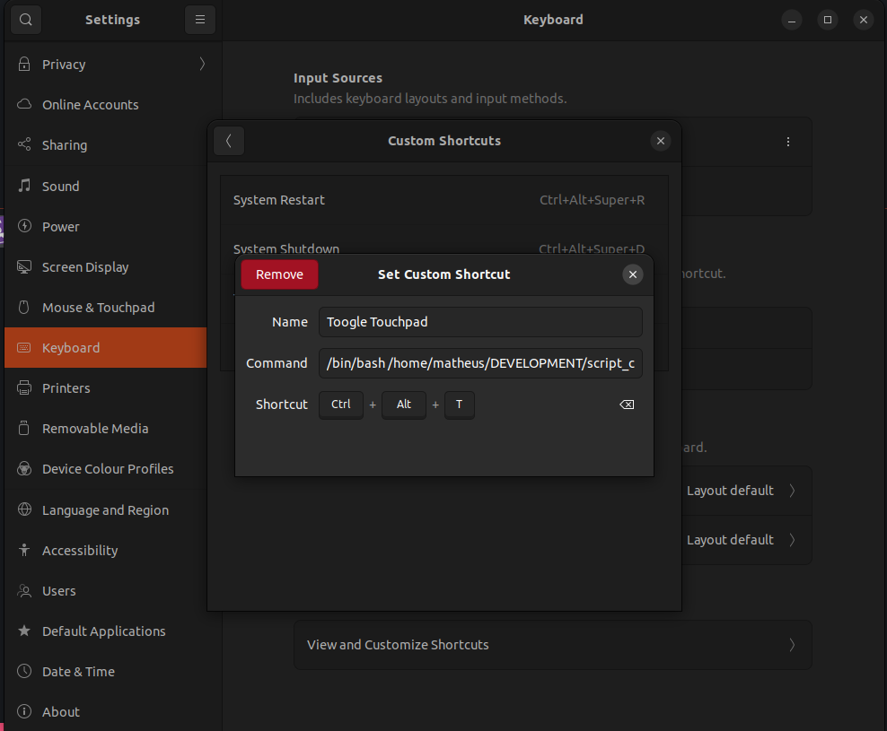

# INSTALL MY CUSTOM SCRIPTS AS SHORTCUT

1. create a file `file.sh`
2. give permissions running: `chmod +x file.sh`
3. run it as: `/bin/bash /...path here.../file.sh`

##### settings > keyboard > View and Customize Shortcuts > CUSTOM SHORTCUTS

