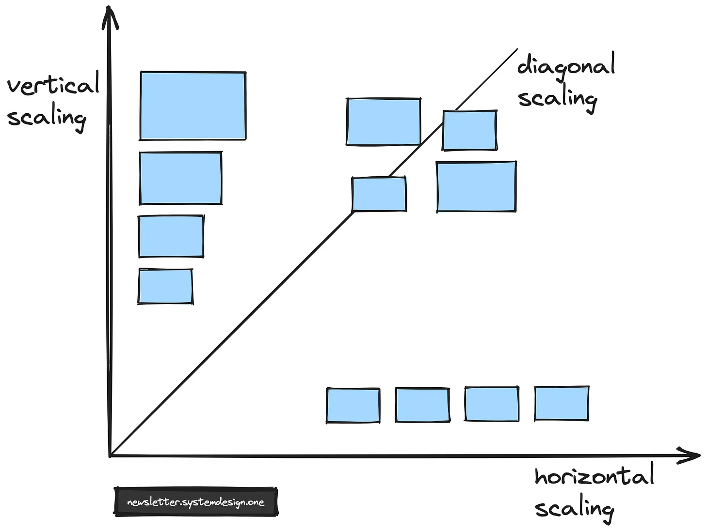
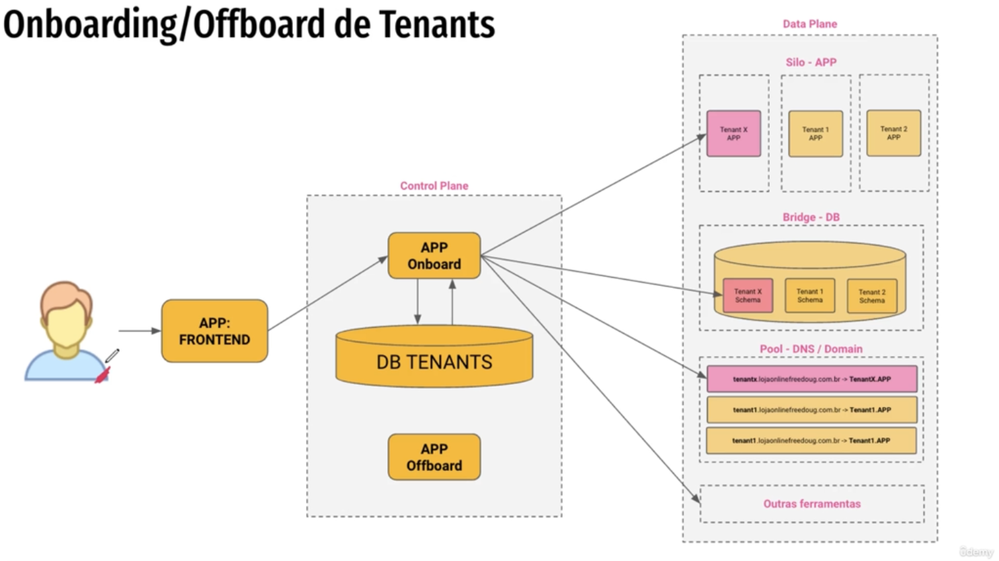
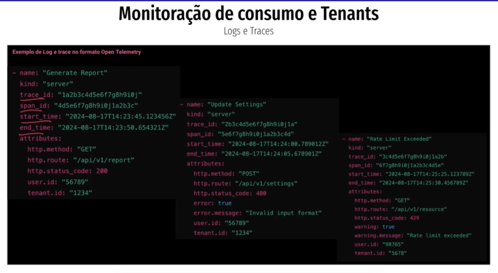
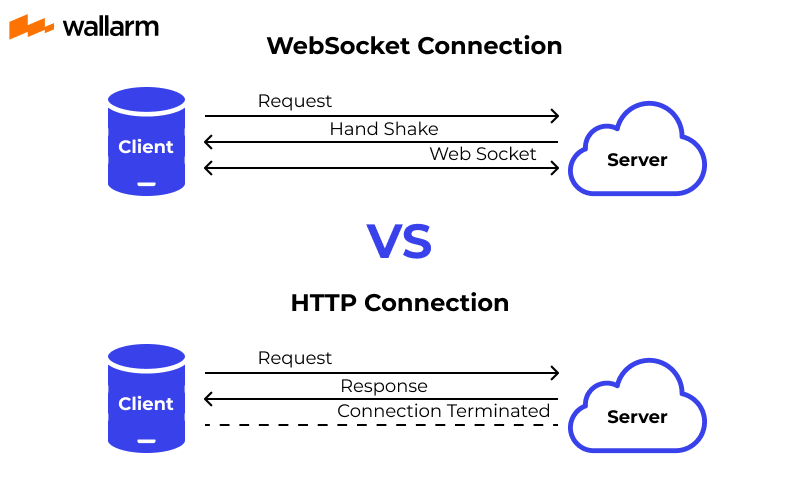

SUMMARY

- [Horizontal x Vertical SCALE:](#horizontal-x-vertical-scale)
- [When receives lots requests, how to avoid it fall?](#when-receives-lots-requests-how-to-avoid-it-fall)
- [How to build a onboarding Tenants Architecture?](#how-to-build-a-onboarding-tenants-architecture)
- [How to monitory/trace your Tenants?](#how-to-monitorytrace-your-tenants)
- [How to test/prevent a huge access VOLUME coming up?](#how-to-testprevent-a-huge-access-volume-coming-up)
- [Function (vs) No-functional requirements?](#function-vs-no-functional-requirements)
- [KAFKA (x) SNS/SQS, When use?](#kafka-x-snssqs-when-use)
- [Websocket | Webhook | TCP | HTTP, when use it?](#websocket--webhook--tcp--http-when-use-it)

## Horizontal x Vertical SCALE:

- `Horizontal SCALE`: when you have increase the number of instances.
- `Vertical SCALE`: when you increase the resources for the UNIQUE instance (memory, cpu, etc.) you have.
- `Diagonal SCALE`: when is a hybrid of horizontal and vertical scaling.

Picture: 

 
 

## When receives lots requests, how to avoid it fall?

1. ADD LIMIT P/ REQUESTS:

   1. we can add a limit of requests per client-token
   2. have a system that know how much token it can provide, and then,
   3. give some tokens and scale if reach 70% of the tokens

2. CIRCUIT BREAKER: avoid timeouts
   1. add a layer between the CLIENT and SERVICE
   2. this layer might be a service as well, that will:
   3. check each request status and timing
   4. if the main service reach a limit of requests, the circuit break can turn the system off, then:
   5. avoid time outs then return quick user messages

 
 

## How to build a onboarding Tenants Architecture?

class: https://www.udemy.com/course/fundamentos-de-arquitetura-saas/learn/lecture/45469653#notes

 
 

## How to monitory/trace your Tenants?

class: https://www.udemy.com/course/fundamentos-de-arquitetura-saas/learn/lecture/45469663#notes

## How to test/prevent a huge access VOLUME coming up?

1. `Load testing`: Load testing is the process of measuring the performance of the system under the anticipated load. Basically you volume right now is supporting 100 requests per second, lest test on double it with 200? and 300? and 400?_** this is load testing, how you services/application supports with artificial production traffic and DNS configuration changes for load testing**_

## Function (vs) No-functional requirements?

- `Functional Requirements`: Feature that the system will offer to the user.

  - _Questions to make to understand the requirements_:
    - What are the features that we need to design for this system?
    - What are the edge cases we need to consider, if any, in our design?

- `Non-Functional Requirements`: The quality constraints that the system must satisfy according to the project grows or in contract, for example: Portability, Security, Maintainability, Reliability, Scalability, Performance, Reusability, Flexibility.
  - _Questions to make to understand the requirements_:
    - Our system should record metrics and analytics?
    - Service heath and performance monitoring?

Examples:

1. Online Banking System

1. Functional Requirements:

   - Users should be able to log in with their username and password.
   - Users should be able to check their account balance.
   - Users should receive notifications after making a transaction.

2. Non-functional Requirements:
   - The system should respond to user actions in less than 2 seconds.
   - All transactions must be encrypted and comply with industry security standards.
   - The system should be able to handle 100 million users with minimal downtime.
   

2. Food Delivery App

1. Functional Requirements

   - Users can browse the menu and place an order.
   - Users can make payments and track their orders in real time.

2. Non-functional Requirements:
   - The app should load the restaurant menu in under 1 second.
   - The system should support up to 50,000 concurrent orders during peak hours.
   - The app should be easy to use for first-time users, with an intuitive interface.
   

## KAFKA (x) SNS/SQS, When use?

which message broker to choose:

- `Apache Kafka`: Very large volumes of data, flexible scalability, and basic routing needs.
  - GOOD: you can audit the message cause kafka as a log that you can audit it in case needs (replicate a bug? gov auditor?)
  - GOOD: process in real time million of messages (depends of your infrastructure)
  - BAD: responsible for this infrastructure and cluster where is gonna run
  - BAD: complexity on managing
     
- `SNS/SQS`: Large volumes of data and a fully hosted option, don't need to setup nothing only connect.
  - GOOD: easy to implement (publishing and consuming)
  - GOOD: do';t need to care about infrastructure is just a SaaS (software as a service)
  - GOOD: process lots message quickly but not like kafka
  - BAD: can be more expensive than KAFKA as you business grows

## Websocket | Webhook | TCP | HTTP, when use it?

- `Websocket`: you can open a connection and traffic data faster than rest, cause you do hand shake once
  - very low latencies
  - _indicates for_:
    - broadcast streaming notifications
    - realtime location or traffic updates (UBER)
    - maps and Geolocation'
    - real time trades

 

- `Webhook`: used for only one way communication, like a topic. You subscribe your end-point and someone will call you when needed with the payload pre defined in contract.
  - _indicates for_:
    - Payment gateway notifying merchants about a payment
    - Monitoring systems alerts
    - SaaS softwares notifications

 

- `TCP`: used for transmit large data. As each packet is received at the destination, an acknowledgment is sent back to the sender. If the sender does not receive the acknowledgment in a certain period of time, it simply sends the packet again. To protect the sequence, further packets cannot be sent until the missing package has been successfully transmitted and an acknowledgment received.
  - _indicates for_:
    - large data transmission

 

- `HLS or HTTP live streaming`: HLS is the most popular streaming protocol available today because it’s robust and effective.
  - YouTube uses an HTML5 video player, which means that HLS is the standard protocol for delivery. The HLS protocol is suitable for streaming to practically any internet-enabled device and operating system.

 

- `HTTP`: you request something and get the response, after that, your connection is done-terminated
  - _indicates for_:
    - CRUD operations

`WebSockets` **are also more efficient, as they allow data to be transmitted without the need for repetitive HTTP headers and handshakes. This can reduce bandwidth usage and server load.**

