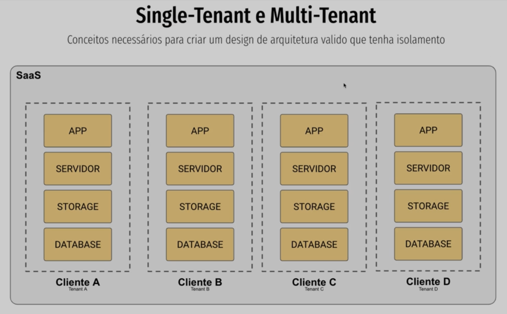
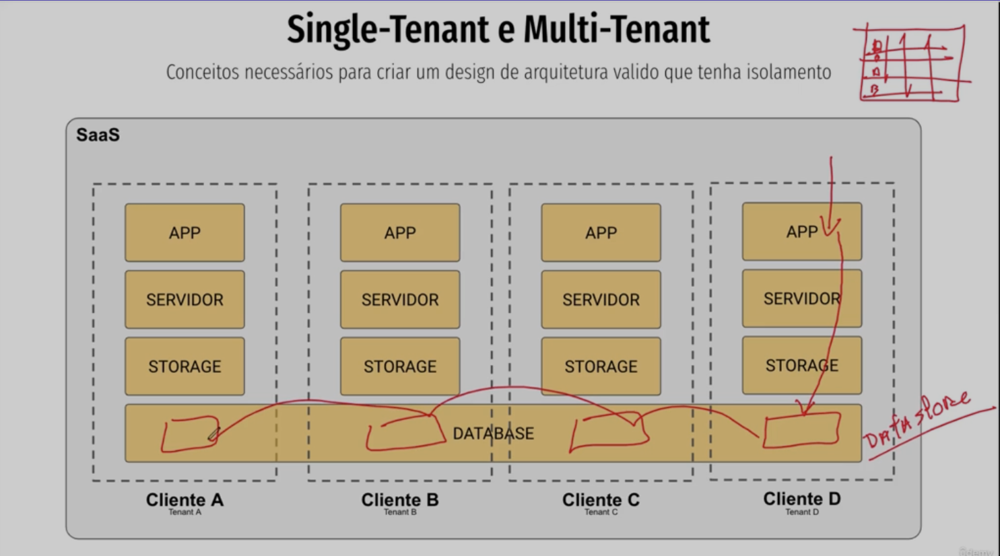
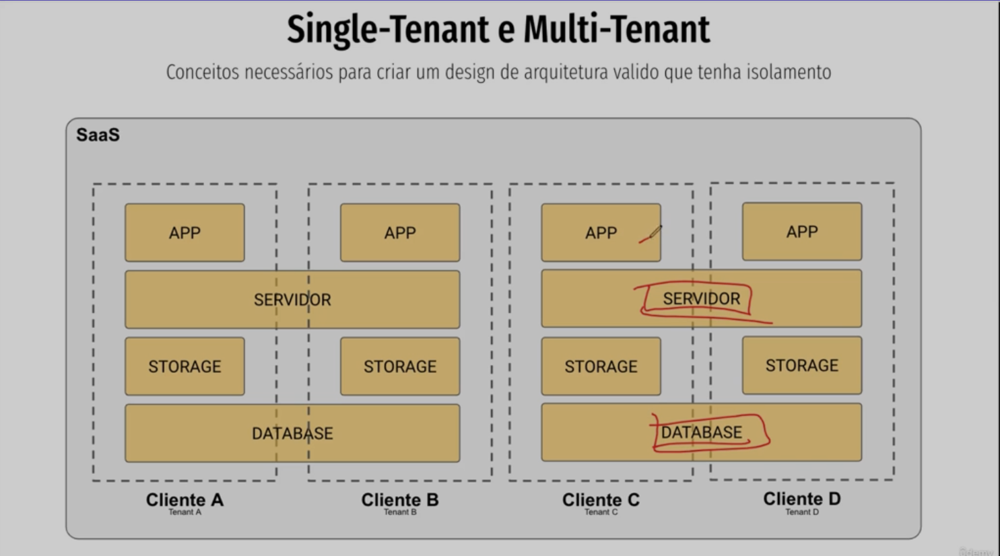
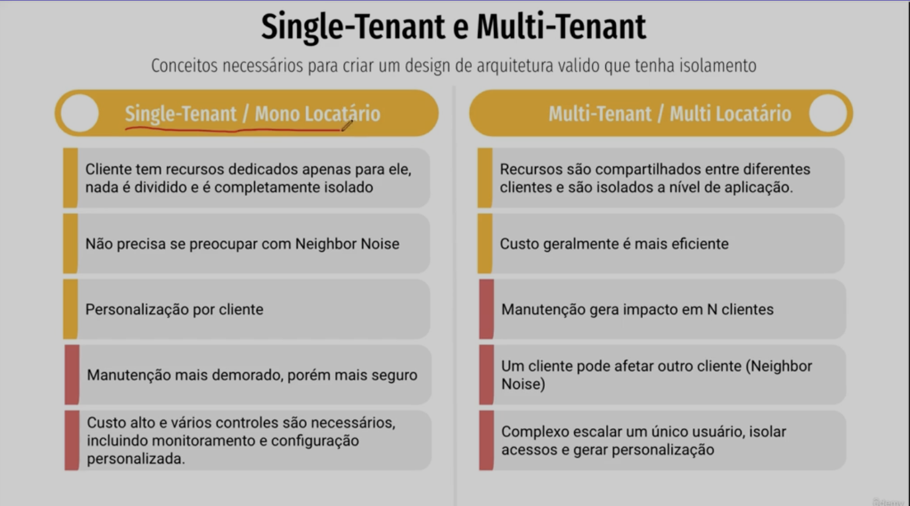
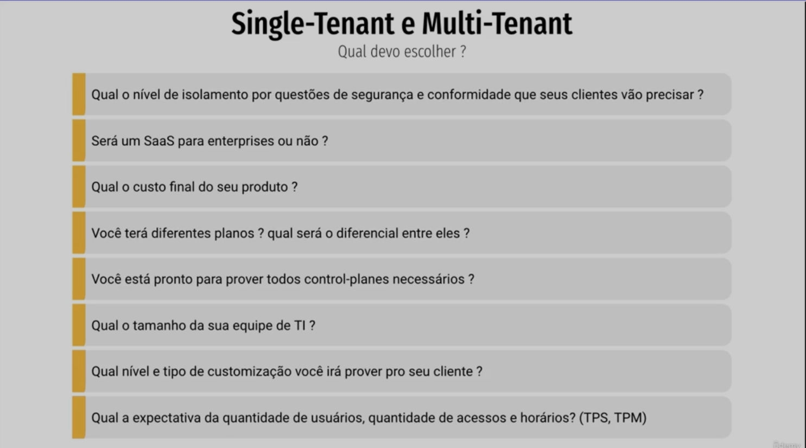
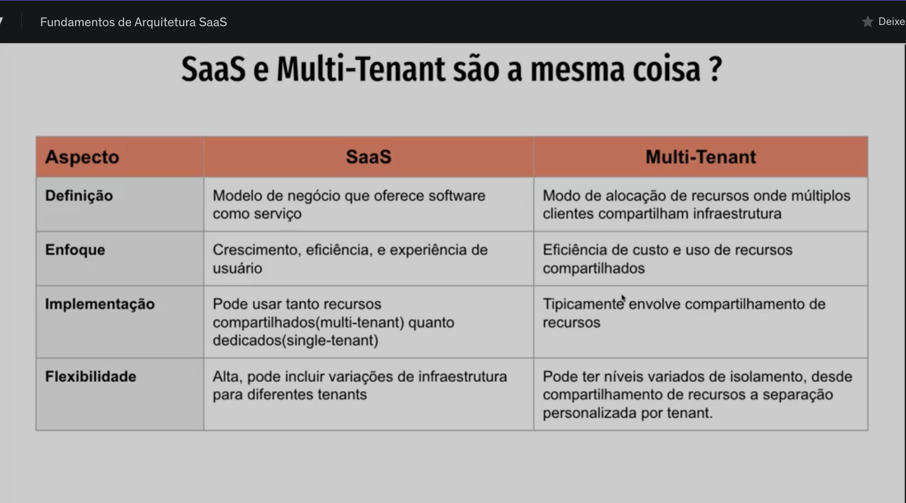
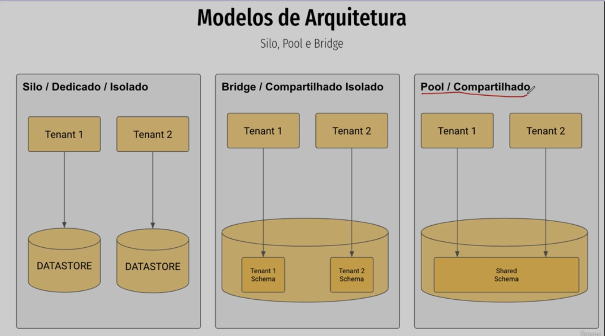
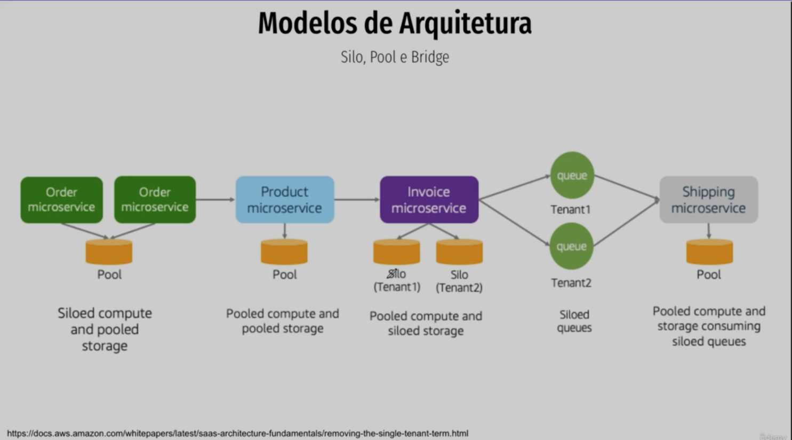
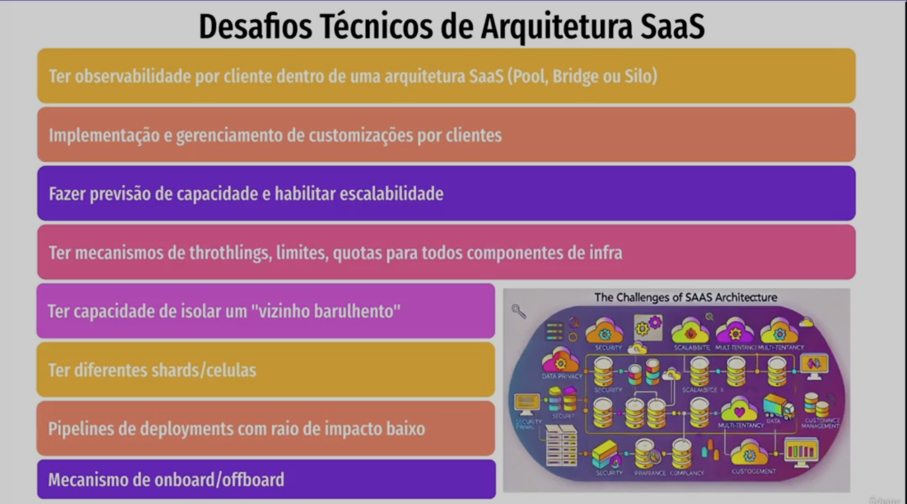
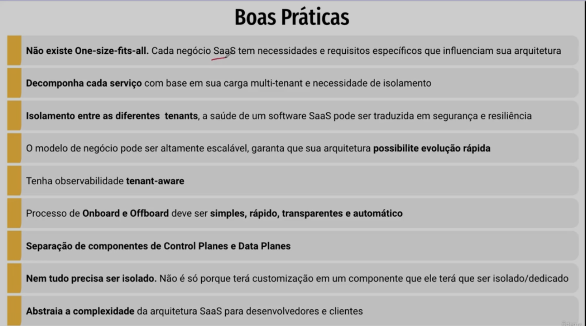

# SECTION-1

Software as a Service (SaaS)

- [SECTION-1](#section-1)
  - [SINGLE-Tenant (vs) MULTI-Tenant](#single-tenant-vs-multi-tenant)
  - [Single or Multi, what is the better option?](#single-or-multi-what-is-the-better-option)
  - [Architecture models](#architecture-models)
  - [Before implement, think about the challenges](#before-implement-think-about-the-challenges)
  - [How to identify the peaces if it is SILO, BRIDGE or POOL](#how-to-identify-the-peaces-if-it-is-silo-bridge-or-pool)
  - [Best Practices](#best-practices)
  - [Factor App](#factor-app)

 
 
 

## SINGLE-Tenant (vs) MULTI-Tenant

**SINGLE-Tenant**: is when each Tenant is isolated from other Tenants. Its means that if the TENANT-A has issue, it wont affect the TENANT-B, because they are ISOLATED

picture: 

 

**MULTI-Tenant**: is when one OR more layers are sharing resources. Then, a fail caused by TENANT-A might affect OTHERS TENANTs.

pictures: 

1. sharing the database only:

2. sharing the server (gateway) + database:

 
 

**ADVANTAGES** (x) **DISADVANTAGES**

 
 
 
 

## Single or Multi, what is the better option?

Make these questions to myself before decide of single or multi tenant.

class: https://www.udemy.com/course/fundamentos-de-arquitetura-saas/learn/lecture/45466277#overview

class: https://www.udemy.com/course/fundamentos-de-arquitetura-saas/learn/lecture/45466283#notes

 
 
 
 

## Architecture models

- SILO: everything is isolated
- BRIDGE: one service might be shared, like:
  - log server: each container or folder per Tenant, _but all in the same server_
  - database: each table or schema per Tenant, _but all in the same server_
- POOL: is shared, everything is shared.
  - database: only one table with all Tenant
  - topics: all of them is subscribed to the same topic

We can also have some parts of the ecosystem with different models of Architecture.

**\* **With this option you can isolate only the things that matters in terms of confidentiality and then, you can be more COMPETITIVE IN THE MARKETING with lower cost of architecture\*\*.

Class: https://www.udemy.com/course/fundamentos-de-arquitetura-saas/learn/lecture/45466289#notes

 
 
 
 

## Before implement, think about the challenges

Make questions to myself to reach these scenarios:
_(google the names, these are common problems in SaaS architecture)_

Class: https://www.udemy.com/course/fundamentos-de-arquitetura-saas/learn/lecture/45469601#notes

 
 
 
 

## How to identify the peaces if it is SILO, BRIDGE or POOL

1. start from here: https://www.udemy.com/course/fundamentos-de-arquitetura-saas/learn/lecture/45706011#notes

2. the BEST class: https://www.udemy.com/course/fundamentos-de-arquitetura-saas/learn/lecture/45706013#notes

 
 
 
 

## Best Practices

Class: https://www.udemy.com/course/fundamentos-de-arquitetura-saas/learn/lecture/45469605#notes

## Factor App

Sugiro fortemente colocar nos to-dos entender um pouco mais sobre 12-factor app. Aqui uma sequência interessante que cobre todos.

12 - Factor app - Documentação oficial

12 - Factor app - Youtube:

1. [The Twelve-Factor App - Introdução - Padrões de aplicações SaaS](https://youtu.be/haZTaCFk-DA)
2. [The Twelve-Factor App - (Backing services) e Construa, Lance, execute (Build, Release, Run)](https://youtu.be/p0oM_iGREpI)
3. [The Twelve-Factor App - Processos, Vínculo de Porta e Concorrência](https://youtu.be/onoXOUOLgjI)
4. [The Twelve-Factor App - Descartabilidade (Disposability) e devprod iguais (DevProd parity)](https://youtu.be/b-dCQTjIIsc)
5. [The Twelve-Factor App - Logs e Processos de Admin (Admin Processes)](https://youtu.be/wWVo6f6k12k)
6. [The Twelve-Factor App - Telemetria e Autenticação e Autorização](https://youtu.be/BOKGgMKPtv4)

