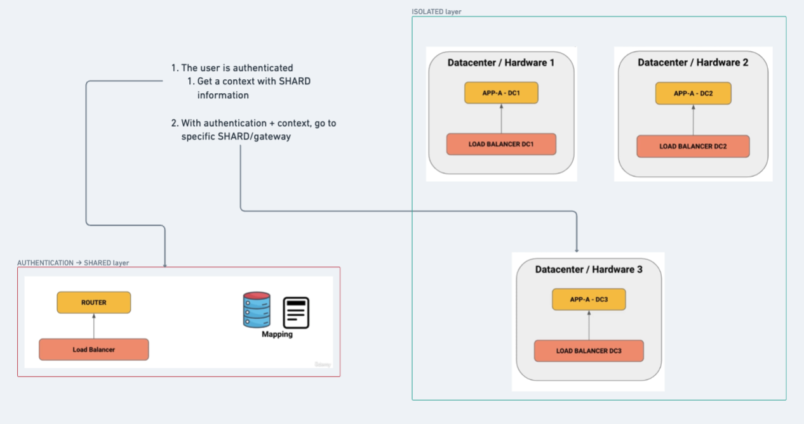
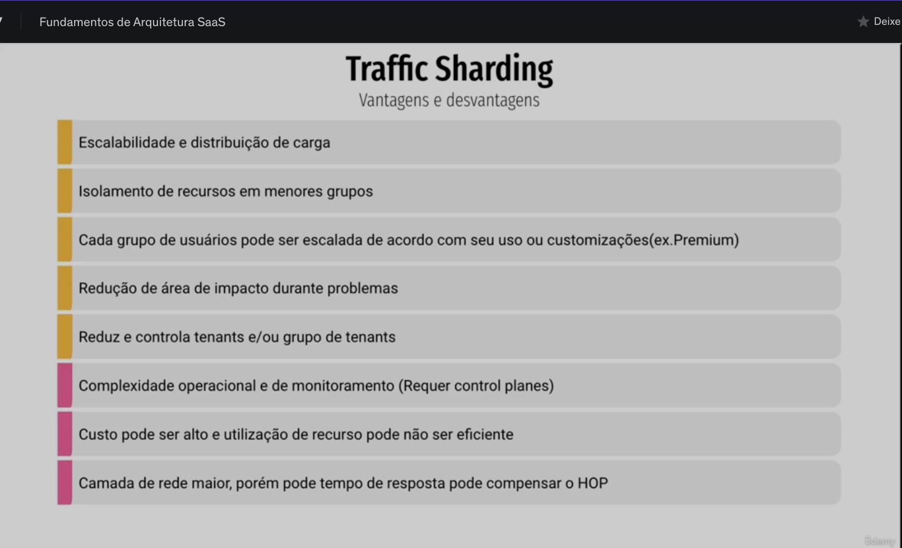
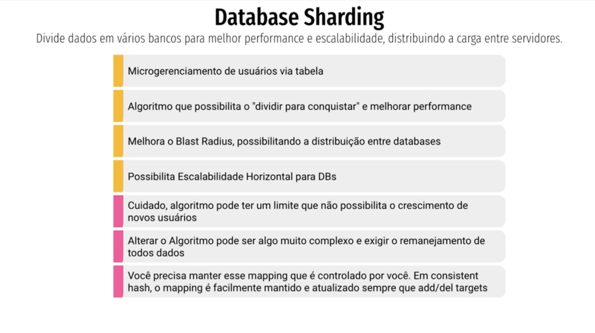

# SECTION-2

Software as a Service (SaaS)

- [SECTION-2](#section-2)
- [Traffic Sharding (Fragment traffic/requests)](#traffic-sharding-fragment-trafficrequests)
- [Database Sharding (Fragment traffic/requests)](#database-sharding-fragment-trafficrequests)

 
 

# Traffic Sharding (Fragment traffic/requests)

class: https://www.udemy.com/course/fundamentos-de-arquitetura-saas/learn/lecture/45469621#notes

This is fragment your traffic or request to have a specific SHARED (containers, data-center, etc).

This strategy is used when I want to have a PREMIUM users with more CPU/MEMORY, ETC then other common users.

> LOAD BALANCING: is the method of distributing network traffic equally across a pool of resources that support an application, it already have Algorithm of put the request in a free instances

 
- ADVANTAGES (x) DISADVANTAGES

# Database Sharding (Fragment traffic/requests)

class: https://www.udemy.com/course/fundamentos-de-arquitetura-saas/learn/lecture/45469625#notes

Split data in many databases to have a better performance and scalability, distributing resources on servers.

