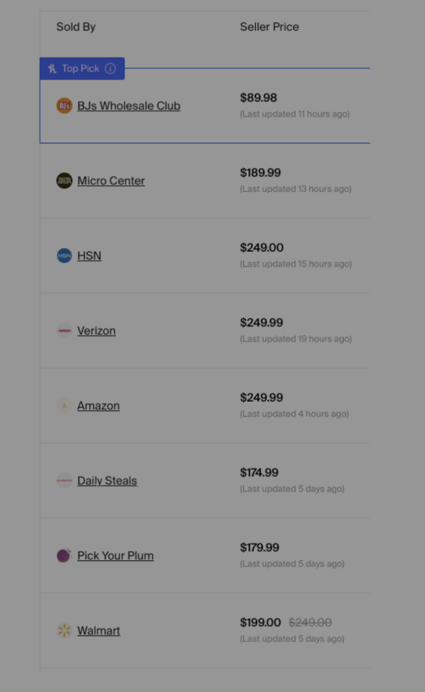
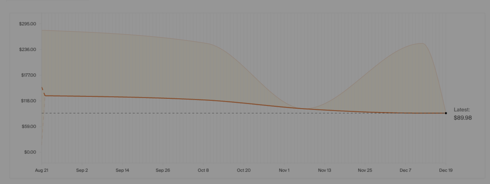
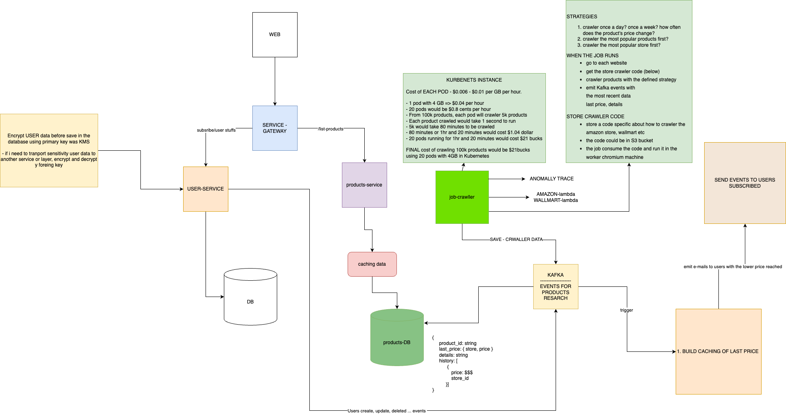

SUMMARY

# Design an online price tracker

### Requirements

1. Users should be able to view current price across multiple retailers and see the best prices
2. Users should be able to see historical prices globally and per merchant
3. Users should be able to track prices of certain items and receive alerts if price drops
4. subscriptions for users

Think about some creative ways to optimize the crawling (can be high level around patterns or technical ways to optimize bandwidth / performance / processing)

### Assumptions

- 20k stores
  - We have a list of 20k sites (e.g. store1.com, store2.com)
- 100k products
  - We have a list of 100k UPC ids
- 1M users
  - No API from retailers (no integration with stores)

### Example about the platform

# My solution

