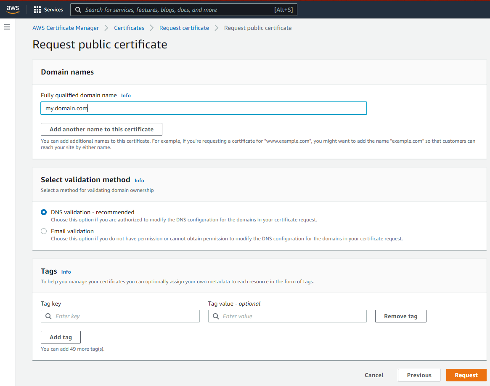
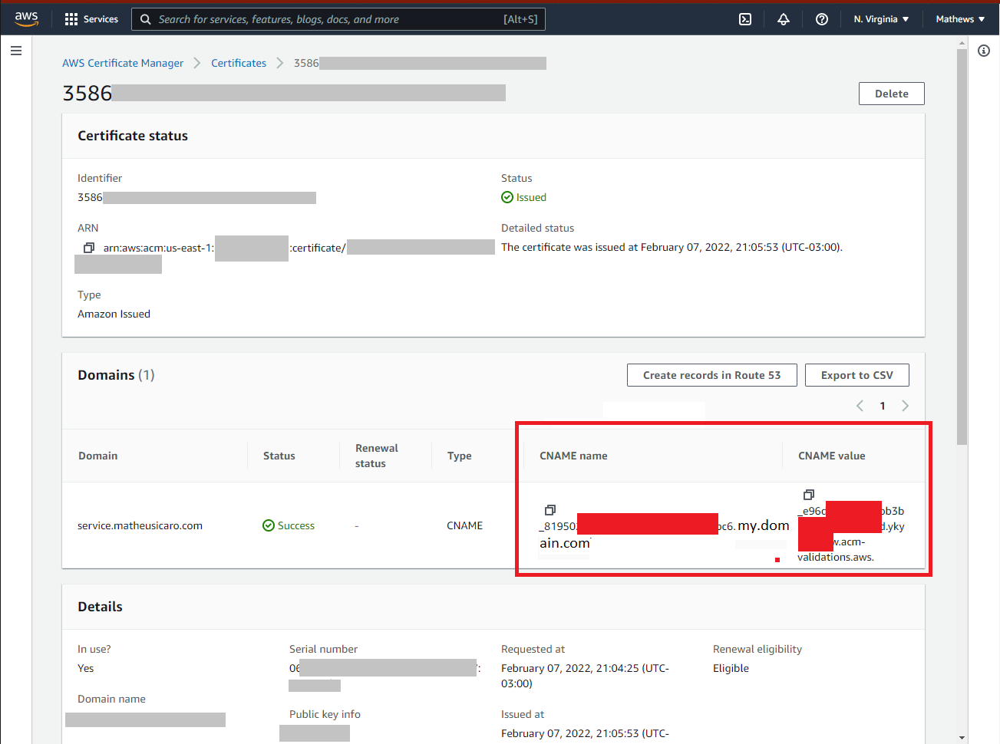
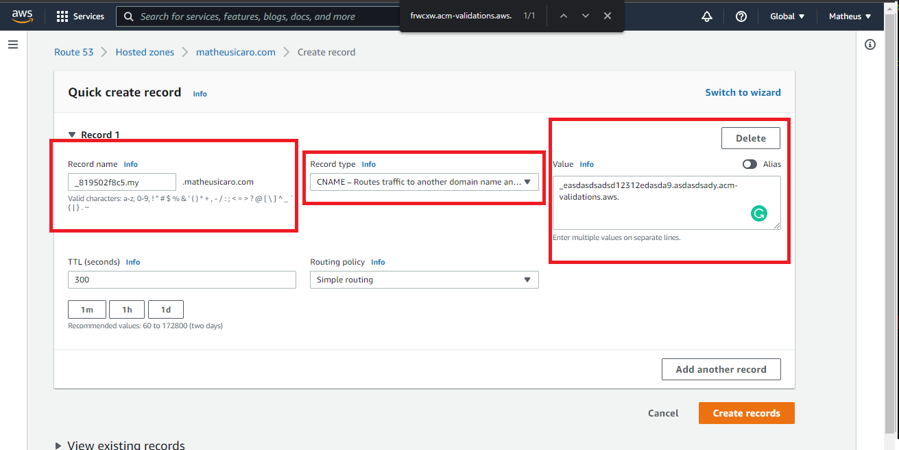

# AWS TUTORIAIS


- [Full web application release](full-web-application-release/README.md)
- [How to Redirect My Domain To External Domains: TO WIX, GODADDY, WORDPRESS](redirect-domain-in-aws-to-external-servers/README.md)
- [How to add Alias from my domain to another url/service/etc](./alias-from-domain-to-another-url/README.md)

- [How To Add **public CA** To Elastic Bean](#how-to-add-public-ca-to-elastic-bean)
- [How To Install **AWS CLI**/aws-vault](#how-to-install-aws-cliaws-vault)
- [ERRORS](#errors)
  - [ERROR: SSL AWS CLI CERTIFICATE](#error-ssl-aws-cli-certificate)

---
<br>
<br>
<br>
<br>
<br>
<br>
<br>
<br>
<br>
<br>
<br>
<br>
<br>
<br>
<br>
<br>
<br>
<br>
<br>
<br>
<br>
<br>
<br>
<br>
<br>
<br>
<br>
<br>
<br>
<br>
<br>
<br>
<br>
<br>
<br>
<br>

# How To Add public CA To Elastic Bean

<details>
<summary>Open here</summary>

1. Request the public certificate



2. copy your **CNAME name** and **CNAME value**



3. In **ANOTHER ACCOUNT**, add your **CNAME name** and **CNAME value**



<br>
</details>

---

# How To Install **AWS CLI**/aws-vault

<details>
<summary>Open here</summary>

1. install aws cli, [here](https://docs.aws.amazon.com/cli/latest/userguide/getting-started-install.html)
2. install aws-vault, [here](https://github.com/99designs/aws-vault)
3. add a profile:

   ```
   aws-vault add PROFILE_NAME

   Enter Access Key ID: <put your access_key_id>
   Enter Secret Access Key: <put your secret_access_key>

   Added credentials to profile "PROFILE_NAME" in vault
   ```

4. check your profile:

   ```
   Profile                    Credentials                Sessions
   =======                    ===========                ========
   default                    -                          -
   PROFILE_NAME               PROFILE_NAME               -

   ```

5. done!

<br>
</details>

---

# ERRORS

## ERROR: SSL AWS CLI CERTIFICATE

<details>
<summary>Open here</summary>

1. Create the AWS CA Bundle

```
 curl https://www.amazontrust.com/repository/{SFSRootCAG2,AmazonRootCA4,AmazonRootCA3,AmazonRootCA2,AmazonRootCA1}.pem >> ~/.aws/ca_bundle.pem
```

2. Configure the SDK (choice)
   - should have AWS cli installed
   - run: `aws configure set ca_bundle '~/.aws/ca_bundle.pem'`
   - add the env: `AWS_CA_BUNDLE='~/.aws/ca_bundle.pem'`

<br>
<br>
</details>

---
