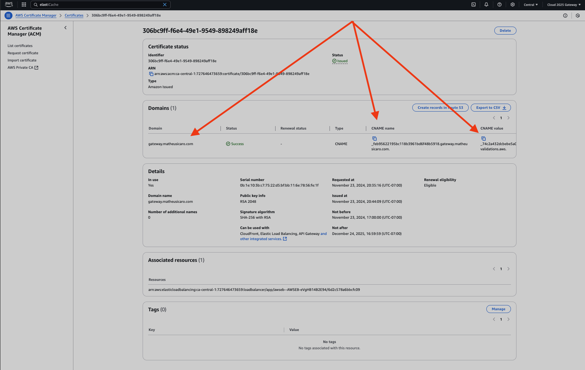
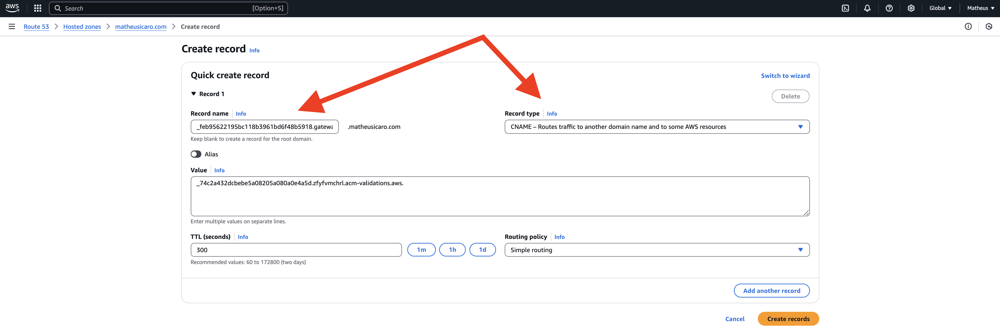
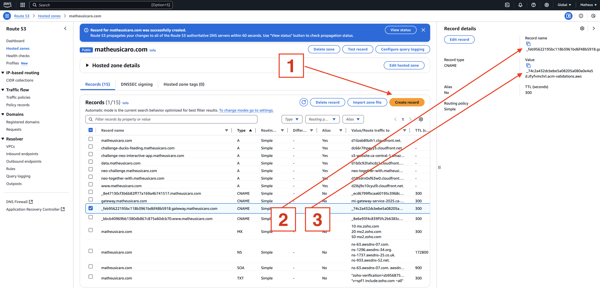
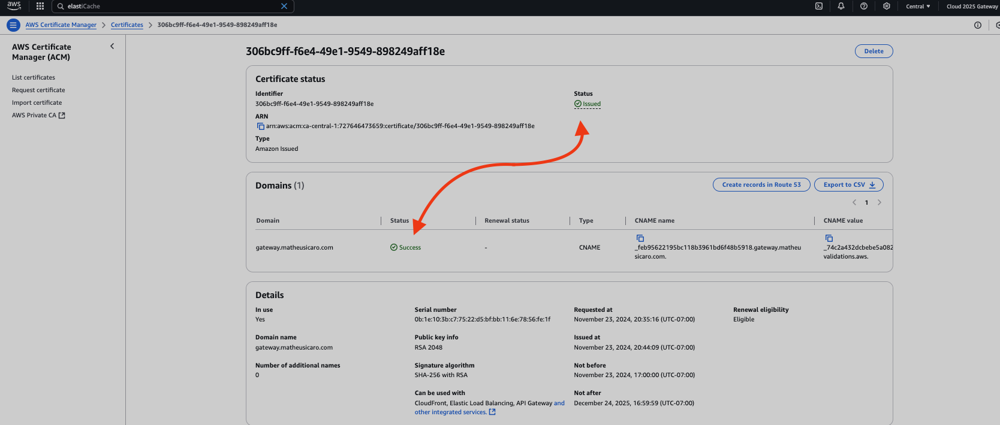
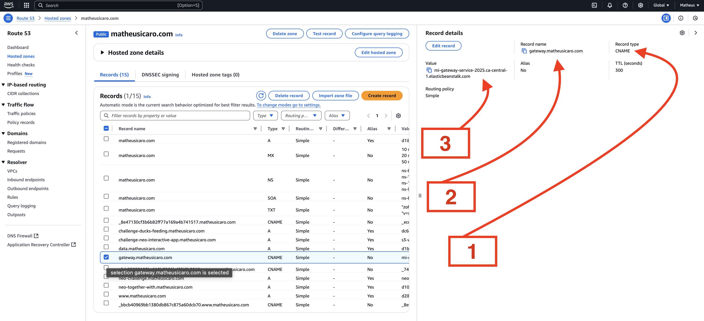

# ALIAS FROM MY DOMAIN TO ANOTHER URL/SERVICE/ETC

### 1. In the new `NEW ACCOUNT`

- 1.1. copy the "CNAME name" and "CNAME value"

 
 

### 2. Go to my `MAIN` account

2.1. create a record the "CNAME name" and "CNAME value"

 
 

### 3. In the new `NEW ACCOUNT`

- 3.1 check if the certificate is issued

 
 

### 4. Go to my `MAIN` account

- 4.1 Create the record with "CNAME" which is the redirect to the new URL

