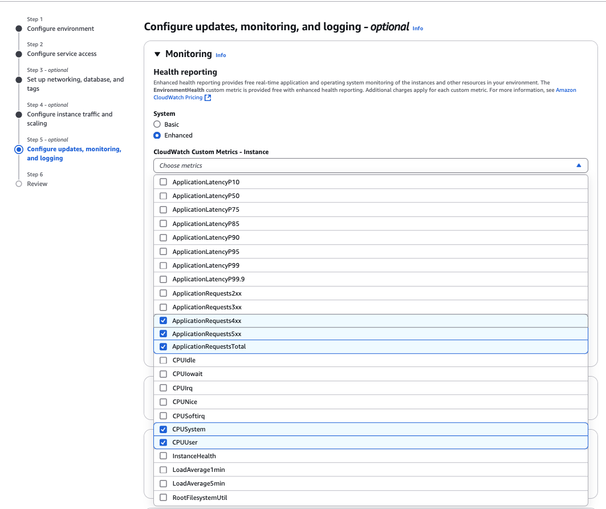
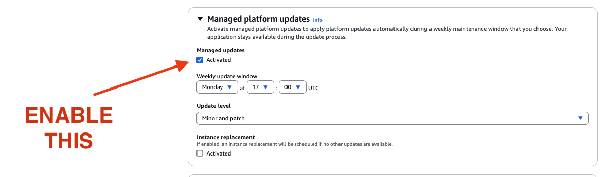

# FULL WEB APPLICATION RELEASE IN AWS

<br>

- [How to Redirect My Domain To External Domains: TO WIX, GODADDY, WORDPRESS](/cloud/aws-tutoriais/redirect-domain-in-aws-to-external-servers/README.md)

<br>

---

<br>
<br>

## 1. Create a new E-MAIL account

I normally create with like: `cloud_<year>@gmail.com`

<br>

## 2. Create AWS DEFAULT application in Elastic Beanstalk

> < ! > for any error, check the **[documentation HERE](https://docs.aws.amazon.com/elasticbeanstalk/latest/dg/environments-cfg-autoscaling-launch-templates.html#environments-cfg-autoscaling-launch-templates-options)**

<details>
<summary>Open it here: </summary>

    1. Create AWS DEFAULT application in Elastic Beanstalk

- [Elastic Beanstalk here](https://ca-central-1.console.aws.amazon.com/elasticbeanstalk/home?region=ca-central-1#/applications)


<br>
<br>
<br>

    2. Create Environment


<br>
<br>
<br>

        2.1. STEP: Configure environment

- Application name: `mi-backend-<YEAR>`
- Environment name: `Mi-backend-<YEAR>-env`
- domain: `mi-backend-<YEAR>`


<br>
<br>
<br>

        2.2. STEP: Configure service access

<br>

<br>

- 2.2.1 create and use new service role
- 2.2.2 check the roles names and roles to be created in IAM


---

<details>
<summary>````| 2.2.3. | - Create the IAM Roles here</summary>

<br>

- Create the role `aws-elasticbeanstalk-ec2-role`
  - AWSElasticBeanstalkMulticontainerDocker
  - AWSElasticBeanstalkWebTier
  - AWSElasticBeanstalkWorkerTier


<br>
<br>

- Create the role `aws-elasticbeanstalk-service-role`
  - AWSElasticBeanstalkEnhancedHealth
  - AWSElasticBeanstalkManagedUpdatesCustomerRolePolicy


        ````| 2.2.3. | - END

</details>

---

<br>

- select the roles after being created ( _step 2.2.3. above_ ^ )
  

<br>
<br>
<br>

        2.3. STEP: Set up networking, database, and tags

N/A => Next

<br>
<br>
<br>

        2.4. STEP: Configure instance traffic and scaling

- select the disk ( THIS WAS MY MISTAKE IN 2024 with the new updates )


<br>
<br>
<br>

        2.5. STEP: Configure updates, monitoring, and logging

- Configure updates, monitoring, and logging - optional




<br>
<br>
<br>

        2.6 The application should be created successfully


<br>
<br>
</details>
<br>

## 3. Create CodePipeline

<details>
<summary>Open it here: </summary>

<br>

- [CodePipeline here](https://ca-central-1.console.aws.amazon.com/codesuite/codepipeline/start?region=ca-central-1)

<br>


<br>
<br>

    1. STEP 1:


<br>
<br>
<br>

    2. STEP 2:

Connect to Github by `@matheusicaro`


<br>
<br>
<br>

    3. STEP 3:


<br>
<br>
<br>

    4. STEP 4:


<br>
<br>
<br>

    5. STEP 5:

The application should be created successfully!!!


<br>
<br>
</details>

<br>

## [4. Setup SSL CERTIFICATE && Redirect from `service...` to new ELASTIC BEING STALK](./../alias-from-domain-to-another-url/README.md)

<br>

## 5. Finish the APP account setup

<details>
<summary>Open it here: </summary>

<br>
<br>

    1. Back to Elastic Beanstalk here

- [Elastic Beanstalk here](https://ca-central-1.console.aws.amazon.com/elasticbeanstalk/home?region=ca-central-1#/applications)

<br>
<br>
<br>

    2. Enable the load balance with 1 instance only


<br>
<br>
<br>

    1. Add the HTTPS for 443 with the certificated added "in step 4"


<br>
<br>

    4. The service now should be ready and listening from the HTTPS

    5. CREATE the bill ALERT TO AVOID SPEND ANY CENT IN CLOUD


    6. EDIT THE ALERT AGAIN PARA DAILY alerts


