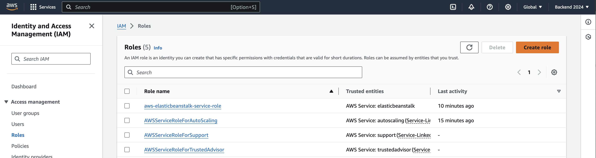
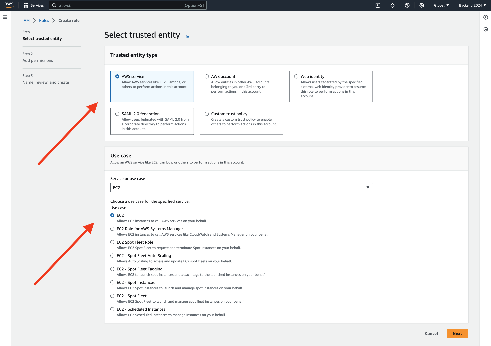
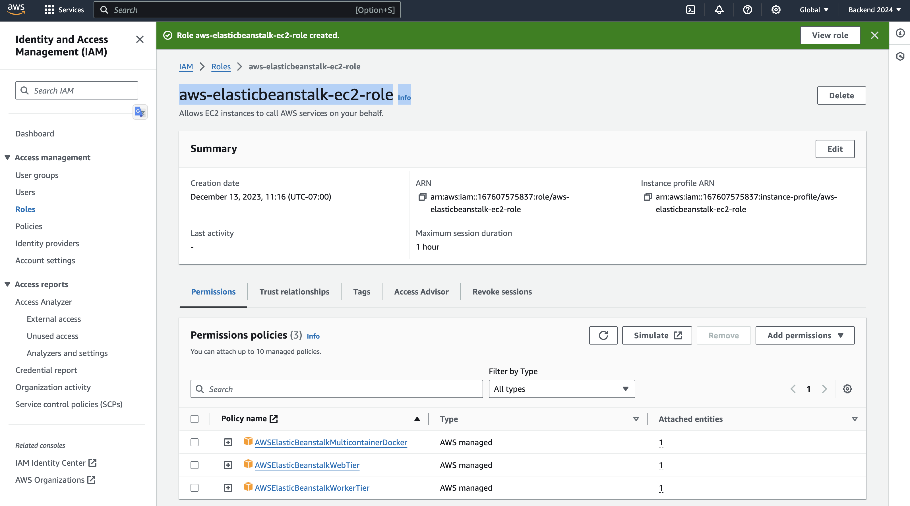

# IAM Role

## 1. Go to [Identity and Access Management (IAM) here](https://us-east-1.console.aws.amazon.com/iam/home?region=ca-central-1#/roles)

## 2. ROLE NAME: `aws-elasticbeanstalk-ec2-role`

#### 2.1. STEP: Select trusted entity

 
 

#### 2.2. STEP: Add permissions

According to this [AWS Doc here](https://docs.aws.amazon.com/elasticbeanstalk/latest/dg/GettingStarted.CreateApp.html), we should add this roles:

1. `AWSElasticBeanstalkWebTier`
2. `AWSElasticBeanstalkWorkerTier`
3. `AWSElasticBeanstalkMulticontainerDocker`

#### 2.3. Name, review, and create

THE NAME OF THE ROLE NEEDS TO BE: `aws-elasticbeanstalk-ec2-role`

Review it and add the role name, that's all!!!

## 3. ROLE NAME: `aws-elasticbeanstalk-service-role`

> CHECK IF THE ROLE IS ALREADY CREATED, IF NOT, THEN YOU CAN CREATE IT

Repeat the same PROCESS IN STEP 2: 

1. `AWSElasticBeanstalkEnhancedHealth`
2. `AWSElasticBeanstalkService`

