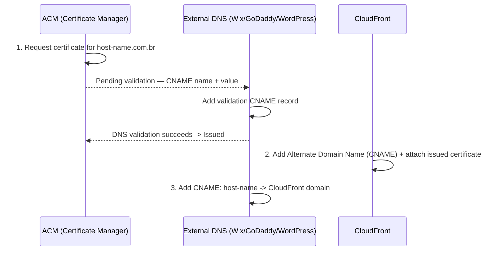

# How to Redirect My Domain To External Domains: TO WIX, GODADDY, WORDPRESS

Point a domain that's registered/hosted elsewhere (Wix, GoDaddy, WordPress) at content served from AWS (S3 + CloudFront), by issuing an ACM certificate for that domain and adding it as a CloudFront alternate domain name (CNAME).

#### 1. Create domain authority certificates

Request a public certificate in ACM (DNS validation) for the external domain, e.g. `host-name.com.br`:

| Field | Value |
| --- | --- |
| Domain | `host-name.com.br` |
| Validation status | Pending validation |

Add the CNAME record ACM gives you to the DNS configuration for that domain:

| Name | Type | Value |
| --- | --- | --- |
| `_daad31a0e22a48b6d35ab68e9d18ebd8.host-name.com.br` | CNAME | `_abe8e165efc3af5391b00490a73ecfcc.hkmpvcwbzw.acm-validations.aws.` |

Once the record propagates, ACM flips the certificate to **Issued**.

#### 2. Configure CloudFront for a bucket with domain CNAMEs + the certificate

CloudFront distribution overview — note the origin (S3 bucket) and the CNAME already attached:

| Field | Value |
| --- | --- |
| Distribution ID | `E3JW9DYS0HLU70` |
| Delivery Method | Web |
| Alternate Domain Names (CNAMEs) | `host-name.com.br` |
| SSL Certificate | `certificate-name.com.br` (ACM ARN) |
| Domain Name | `bucket-name.cloudfront.net` |
| Custom SSL Client Support | Clients that Support SNI (recommended) |

Edit Distribution → Distribution Settings:

- **Alternate Domain Names (CNAMEs)**: `host-name.domain.com.br`
- **SSL Certificate**: Custom SSL Certificate → pick the ACM cert requested in step 1 (`certificate-name.com.br`)

CloudFront Distributions list view — shows the mapping end-to-end:

| Domain Name | Origin | CNAMEs | Status | State |
| --- | --- | --- | --- | --- |
| `domain.cloudfront.net` | `bucket-host.s3.amazonaws.com` | `ca-host-name.com.br` | Deployed | Enabled |

Error Pages tab — useful for SPAs (redirect 4xx codes back to `index.html` so client-side routing handles them):

| HTTP Error Code | Error Caching Min TTL | Response Page Path | HTTP Response Code |
| --- | --- | --- | --- |
| 400 | 10 | `/index.html` | 200 |
| 403 | 10 | `/index.html` | 200 |
| 404 | 10 | `/index.html` | 200 |
| 414 | 10 | `/index.html` | 200 |

#### 3. WIX domain control

In Wix → Domains → CNAME (Aliases), add a record pointing the host at the CloudFront domain, alongside the ACM validation CNAME:

| Nome do Host | Valor | TTL |
| --- | --- | --- |
| `host-name.domain.com.br` | `domain.cloudfront.net` | 1 hora |
| `_<validation-name>...` | `_<validation-value>...acm-validations.aws` | 1 hora |
| `www.domain.com.br` | `www.wixdns.net` | 1 hora |

#### 4. GoDaddy

In GoDaddy → DNS Management → Records, add a CNAME:

| Type | Name | Value | TTL |
| --- | --- | --- | --- |
| CNAME | `prefix` | `host.aws.com` | 1 Hour |

#### 5. WordPress

In WordPress (Domains → DNS records), add a CNAME aliasing the subdomain to the target host:

| Type | Name (Host) | Alias Of (Points To) |
| --- | --- | --- |
| CNAME | `prefix.host` | `host.aws.com` |
