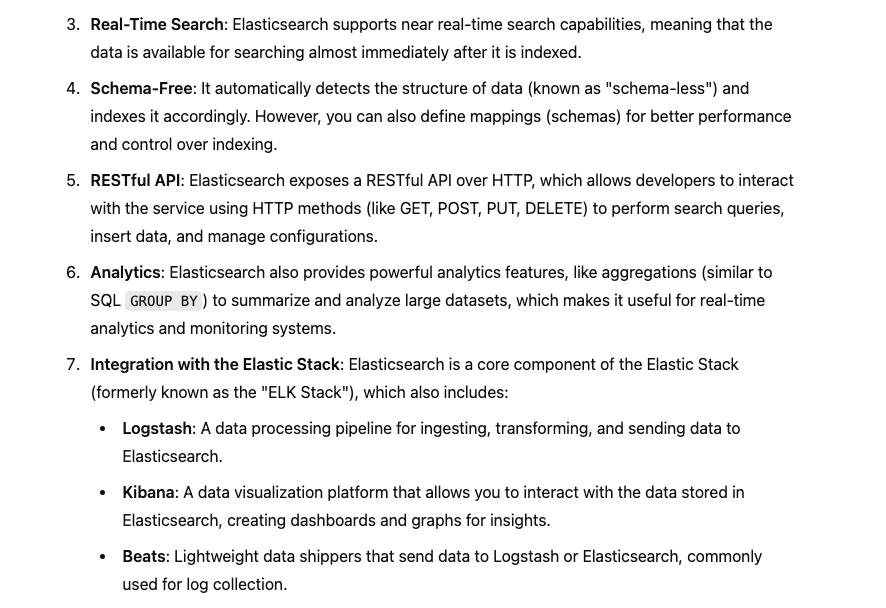
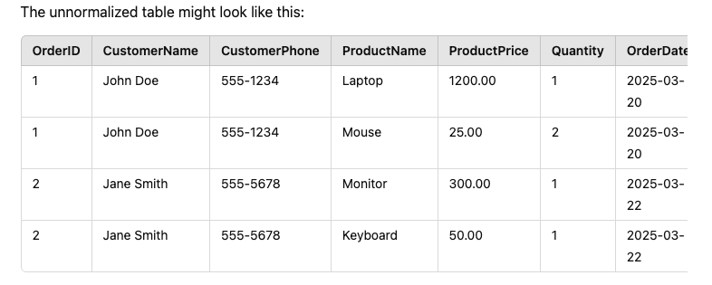
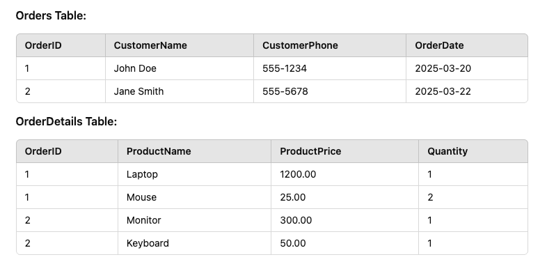
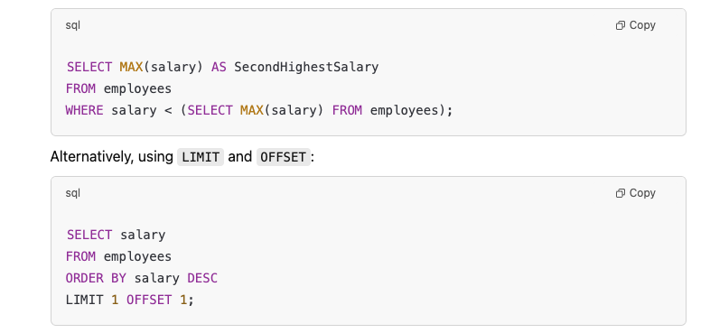

> Bora estudar

My reminders and notes about useful codes in the daily life of a Dev.

- [Database](#database)
  - [difference between SQL x Non-SQL](#difference-between-sql-x-non-sql)
  - [ELASTIC SEARCH](#elastic-search)
  - [SQL](#sql)
    - [basic](#basic)
    - [Queries \& Performance](#queries--performance)
    - [PostgreSQL (x) MySQL](#postgresql-x-mysql)

# Database

## difference between SQL x Non-SQL

answer: 

- SQL: store data in tables structure by rows and column, and you use keys to define relationships between tables. PostgreSQL, MySQL

- Non-SQL: store data in documents formats, by key and value, which is more flexible in terms of schema design: Examples: MongoDB, Redis, Cassandra

 
 

## ELASTIC SEARCH

Its a search engine to handle with large volumes of data
and its really fast real-time text search and grab analytics from it

 
 

## SQL

### basic

Primary (x) Foreign (x) unique key 

- `Primary` key: Unique identifier for each record in a table. So, every table should have a primary key, Example: client_id in a Users table, card id in a Cards table

- `Foreign` key: Define a relationship between two tables, basically by linking to the primary key of another table. Example: user_id in Cards table, which refer to the primary key in the Users table.

- `Foreign` key: Define a unique value in a column, for example, email in Users table might be unique. Example: you can only have one unique email in users.

 

Indexes, advantages (x) disadvantages

- Advantages: Improves the performance for searching, like SELECT queries.

- Disadvantages: make some operations to be slow like INSERT and UPDATEs

 

What is normalization? 1NF, 2NF, 3NF, BCNF?

- Normalization: is basically the process of organizing data in a way that reduces redundancy and dependency.

For example: `let me think...`, a table with ORDERS

 

What is normalization? 1NF, 2NF, 3NF, BCNF?

- Normalization: is basically the process of organizing data in a way that reduces redundancy and dependency.

For example:

> from:
> 

> to:
> 

 

What is denormalization

- Denormalization: is basically merging tables to improve read performance in some cases.
  - advantages: less multiple queries or joins

Normally we use when to remove large joins, specially in cases where the data is complex and normalize it is not worth it.

 

JOIN (x) SUBQUERY?

- JOIN: combines rows from two or more tables based on a related column.

- Subquery: is making a query within another query, for example fetch and filter it on my selecting.

if I am not wrong, JOIN It’s more efficient than subqueries.

 

### Queries & Performance

 

efficient SQL query

 

INNER join, LEFT join, and RIGHT join

- `INNER` join: Returns rows that have matching values in both tables.

  - use when: _you need only matching rows,_

- `LEFT` join: Returns all rows from the left table, and matched rows from the right table.... If no match, returns NULL for right table columns.

  - use when: _you need all records from the left table_

- `RIGHT` join: Returns all rows from the right table, and matched rows from the left table.... If no match, returns NULL for left table columns.

  - use when: _you need all records from the right table_

 

aggregate functions? GROUP_BY (x) HAVING 

- Aggregate Functions: Functions like COUNT(), SUM(), AVG(), MAX(), MIN() that perform calculations on a set of values.

- GROUP BY: Groups rows sharing the same values into summary rows (e.g., GROUP BY department to calculate the average salary per department).

- HAVING: Filters records after GROUP BY (e.g., HAVING AVG(salary) > 50000).

### PostgreSQL (x) MySQL

- PostgreSQL: ACID-compliant, supports advanced data types (e.g., JSONB, HSTORE), and full-text search. It's generally considered more feature-rich and extensible, especially for complex queries.

- MySQL: Known for its speed and simplicity, it is widely used in web applications. While it lacks some advanced features of PostgreSQL, it’s often easier to set up and manage.

