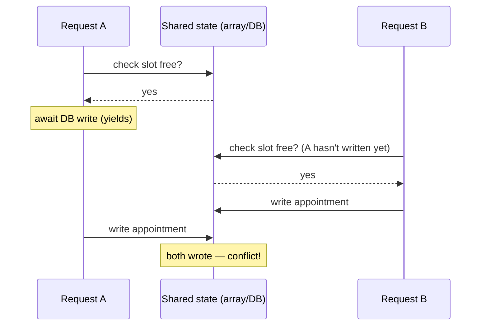

# Node Guideline — Quick Review

1. [Event loop](#1-event-loop)
2. [Single-threaded concurrency](#2-single-threaded-concurrency)
3. [Check-then-act race conditions](#3-check-then-act-race-conditions)
4. [The `yield` keyword (generators)](#4-the-yield-keyword-generators)
5. [Async ops vs. blocking ops](#5-async-ops-vs-blocking-ops)
6. [Microtasks vs. macrotasks](#6-microtasks-vs-macrotasks)
7. [Blocking the event loop](#7-blocking-the-event-loop)
8. [How to avoid blocking the event loop](#8-how-to-avoid-blocking-the-event-loop)
9. [Streams (backpressure)](#9-streams-backpressure)
10. [worker_threads vs. child_process vs. cluster](#10-worker_threads-vs-child_process-vs-cluster)
11. [Code examples — streams, parallelization, batching, safe error handling](#11-code-examples--streams-parallelization-batching-safe-error-handling)

---

## 1. Event loop

- Node = **one JS thread** + libuv (C++ thread pool + OS async I/O) underneath
- Event loop = lets one thread juggle many I/O ops: dispatch → return immediately → pick up results as they land
- Phase order per tick:
  ```
  timers → pending callbacks → poll (I/O) → check (setImmediate) → close callbacks
  ```
- After **every** callback / phase transition → microtask queue (Promises, `queueMicrotask`) drains **fully** first
- ➜ Promise callbacks feel "faster" than `setTimeout(fn, 0)` — this is why

## 2. Single-threaded concurrency

- One thread → two lines of JS **never** execute at the same literal instant
- But: single-threaded ≠ one request at a time
- Node **interleaves**: async point hit → callback parked → event loop runs other ready work → resumes later
- Concurrency here = **interleaving**, not parallelism
  - No two callbacks share a CPU cycle
  - Many callbacks *can* be in-flight (waiting on I/O) at once

## 3. Check-then-act race conditions

- Bug shape: two sequential steps (**check**, then **act**) interleave across two requests when an async gap sits between them



- Not a classic data race (no simultaneous memory access) → it's a **logical race**
- **Test:** zero yield points between check & write → atomic, no race. One yield point → exploitable gap.
- **Real fix = data layer, not JS control flow** (multi-process deployments give zero in-process protection anyway):
  - Unique / exclusion constraint on the conflicting columns
  - Transaction + row lock (`SELECT ... FOR UPDATE`)
  - Atomic `INSERT ... ON CONFLICT`

## 4. The `yield` keyword (generators)

> ⚠️ Different concept from "yields to the event loop" in §5 below — don't
> mix them up. This `yield` is a **generator function** feature, not async I/O.

- Only legal inside a **generator function** — one declared with `function*`
- Each `yield` **pauses** the function and hands a value out to whoever is calling it; the function resumes exactly where it left off when asked for the next value
- The generator does nothing on its own — it's a "recipe," not a running function

```js
function* countUp() {
  console.log("start");
  yield 1;              // pause here, hand out 1
  console.log("resumed after 1");
  yield 2;              // pause here, hand out 2
  console.log("resumed after 2");
  return "done";
}

const gen = countUp();       // nothing runs yet
gen.next(); // "start" logs, returns { value: 1, done: false }
gen.next(); // "resumed after 1" logs, returns { value: 2, done: false }
gen.next(); // "resumed after 2" logs, returns { value: "done", done: true }
```

- **Driving a generator** = calling `.next()` repeatedly, manually or via a loop:
  ```js
  for (const n of countUp()) { console.log(n); }   // for...of drives it automatically
  ```
- **`yield` can also receive a value back**: whatever you pass to `.next(x)` becomes the result of the *previous* `yield` expression — this is how generators can act like two-way channels, not just producers.
  ```js
  function* echo() {
    const x = yield "ready?";   // pauses, hands out "ready?"
    console.log("got:", x);     // runs once resumed with a value
  }
  const g = echo();
  g.next();          // { value: "ready?", done: false }
  g.next("go!");     // logs "got: go!"
  ```

**Why it feels hard:** `yield` by itself has nothing to do with async/await —
it's synchronous pausing controlled by whoever calls `.next()`. It only
*looks* async when something else (like a library, or `async function*` +
`for await...of`) automates the `.next()` calls for you.

**When you'd actually reach for it in practice:**
- Lazily producing a sequence without building the whole thing in memory (`function* range(n) { for (let i = 0; i < n; i++) yield i; }`)
- Implementing a custom iterable (anything usable in `for...of`)
- Async generators (`async function*` + `for await...of`) for streaming data page-by-page from an API or DB cursor
- Under the hood of libraries like Redux-Saga — but you rarely hand-write raw generator-driving code in typical backend/API work

**Rule of thumb:** if you're not building an iterator or a lazy sequence, you probably don't need `yield` — reach for `async`/`await` instead, which is generators + Promises already wired together for you by the language.

## 5. Async ops vs. blocking ops

| Hands control back to the event loop | Blocks (fully synchronous) |
|---|---|
| `await somePromise` | Plain sync function calls, however deep |
| `.then()` / `.catch()` / `.finally()` | `.map` / `.filter` / `.find` / `.forEach` (sync callbacks) |
| Callbacks: `setTimeout`, `fs.readFile`, DB drivers, event emitters | `JSON.parse` / `stringify`, regex, string/math ops |
| Generator `yield` — only if `.next()` is driven asynchronously | `throw` / `catch` |

> **Trap:** `array.forEach(async x => await f(x))` does **not** wait per-element — fires all callbacks immediately, ignores the returned promises.
> - Sequential await → `for...of`
> - Concurrent await → `Promise.all(arr.map(...))`

## 6. Microtasks vs. macrotasks

| | Examples | Timing |
|---|---|---|
| **Microtask** | Promise callbacks, `queueMicrotask` | Drained fully before the loop moves to the next phase/macrotask |
| **Macrotask** | `setTimeout`/`setInterval`, `setImmediate`, I/O callbacks | Each is its own event-loop tick |

- `Promise.resolve().then(fn)` always runs before `setTimeout(fn, 0)`
- Chaining many `.then()`s back-to-back can **starve** timers/I/O from ever getting a turn

## 7. Blocking the event loop

- Node has **no preemption, no timeout** for synchronous code
- Slow sync op (heavy loop, bad regex backtracking, huge `JSON.parse`, `while(true)`) → **freezes the entire process**, not just one request
- Global outage, not a per-request slowdown (unlike thread-per-request servers)
- A proxy/LB may time out the *client connection* — your handler keeps running server-side regardless
- **Fix:** `worker_threads` / queue / separate process, or chunk + yield (`setImmediate`) between batches

## 8. How to avoid blocking the event loop

- **Move CPU-heavy work off the main thread**
  - `worker_threads` for CPU-bound JS (image resizing, crypto, big JSON transforms) — see §10
  - Or offload to a separate process/service via a queue (BullMQ, SQS, Pub/Sub) and respond to the client once queued, not once finished
- **Chunk unavoidable heavy sync work and yield between chunks**
  ```js
  function processInChunks(items, i = 0) {
    const end = Math.min(i + 1000, items.length);
    for (; i < end; i++) doWork(items[i]);
    if (i < items.length) {
      setImmediate(() => processInChunks(items, i)); // give the loop a turn
    }
  }
  ```
- **Use async versions of I/O APIs** — `fs.promises.readFile` / `fs.readFile`, not `fs.readFileSync`, inside request handlers
- **Watch out for "hidden" sync work**, easy to miss:
  - Regex on user-controlled input → catastrophic backtracking (ReDoS) is a classic accidental block
  - `JSON.parse`/`JSON.stringify` on very large payloads
  - Synchronous crypto (`crypto.pbkdf2Sync`, bcrypt sync variants) — use the async variant, or a worker
  - A big `.sort()` / `.map()` / nested loop over a large in-memory array
- **Paginate / stream instead of loading everything at once** — process a DB result set or file as a stream (§9) rather than pulling it all into memory and looping over it synchronously
- **Measure, don't guess** — Node's `perf_hooks`, `--prof`, or watching **event loop lag** (e.g. via `perf_hooks.monitorEventLoopDelay()` or a library like `blocked-at`) tells you if something is actually blocking, and for how long
- **Rule of thumb:** if a single synchronous operation could take more than a few milliseconds on realistic input size, it's a candidate to move off the main thread or chunk

## 9. Streams (backpressure)

- Streams = process data in chunks instead of loading it all into memory (large files/responses)
- **Backpressure:** writable destination slower than readable source →
  - `.write()` returns `false`
  - must wait for `'drain'` event before writing more
  - `.pipe()` handles this automatically
- Ignoring backpressure (tight-loop writes, ignoring return value) → unbounded memory growth

## 10. worker_threads vs. child_process vs. cluster

| Tool | Use case | Shares memory? |
|---|---|---|
| `worker_threads` | CPU-bound JS work (parsing, crypto, image processing) off main thread | Can share via `SharedArrayBuffer` |
| `child_process` | Run another program/script, isolate crashes | No — separate process, IPC via messages |
| `cluster` | Scale one app across CPU cores (multiple processes, shared listening port) | No — separate processes, own event loop/memory each |

- None give real shared mutable state across threads/processes
- ➜ cross-instance coordination (§3) has to happen at the **database**, not in app memory

## 11. Code examples — streams, parallelization, batching, safe error handling

### Streaming a large file/response instead of loading it into memory

```js
const fs = require("fs");

// ❌ Loads the entire file into memory before sending anything —
// a 2GB file means a 2GB spike in process memory, and the client waits
// for the whole read to finish before getting a single byte.
app.get("/export-bad", (req, res) => {
  const data = fs.readFileSync("./big-export.csv");
  res.send(data);
});

// ✅ Streams chunks as they're read — constant memory regardless of file size,
// and the client starts receiving bytes immediately.
app.get("/export-good", (req, res) => {
  const stream = fs.createReadStream("./big-export.csv");
  stream.on("error", (err) => {
    console.error(err);
    if (!res.headersSent) res.status(500).json({ error: "Export failed" });
  });
  stream.pipe(res); // .pipe() handles backpressure automatically (§9)
});
```

### Parallelizing independent async work — `Promise.all` vs sequential

```js
// ❌ Sequential when the work doesn't depend on itself — 3 API calls
// at 200ms each = 600ms total, for no reason.
async function getDashboardDataSlow(userId) {
  const profile = await fetchProfile(userId);
  const orders = await fetchOrders(userId);
  const notifications = await fetchNotifications(userId);
  return { profile, orders, notifications };
}

// ✅ Independent calls run concurrently — same 3 calls, ~200ms total
// (bounded by the slowest one, not the sum).
async function getDashboardDataFast(userId) {
  const [profile, orders, notifications] = await Promise.all([
    fetchProfile(userId),
    fetchOrders(userId),
    fetchNotifications(userId),
  ]);
  return { profile, orders, notifications };
}
```

**The trap:** `Promise.all` rejects as soon as *any* promise rejects, even if the others would have succeeded — reach for `Promise.allSettled` when you need every result regardless of individual failures (e.g. "send 100 reminders, report which ones failed" rather than "abort all reminders because one phone number was invalid").

### Batch processing with a concurrency limit

Unbounded `Promise.all` over a huge array can open thousands of connections at once and overwhelm the downstream service (DB, third-party API, rate limiter). Process in bounded batches instead:

```js
async function processInBatches(items, batchSize, worker) {
  const results = [];
  for (let i = 0; i < items.length; i += batchSize) {
    const batch = items.slice(i, i + batchSize);
    // Promise.allSettled so one bad item doesn't kill the whole batch
    const batchResults = await Promise.allSettled(batch.map(worker));
    results.push(...batchResults);
  }
  return results;
}

// Example: send 10,000 reminders, 20 at a time, so the SMS provider
// isn't hit with 10,000 simultaneous requests.
const results = await processInBatches(reminders, 20, sendReminder);
const failed = results.filter((r) => r.status === "rejected");
console.log(`${failed.length} reminders failed to send`);
```

**Why this shape specifically:** it caps in-flight concurrency to `batchSize` (protects the downstream dependency and your own memory/socket usage), and `allSettled` means one failure in a batch doesn't abort the other 19 requests already in flight.

### Error handling that never leaks a stack trace to the client

```js
// A custom error type so you can distinguish "expected, safe to describe"
// errors from "unexpected, must not describe" errors.
class AppError extends Error {
  constructor(message, statusCode) {
    super(message);
    this.statusCode = statusCode;
    this.isOperational = true; // trusted, safe to show `message` to the client
  }
}

app.post("/appointments", async (req, res, next) => {
  try {
    if (!req.body.patientId) {
      throw new AppError("patientId is required", 400);
    }
    const appt = await bookAppointment(req.body);
    res.status(201).json({ success: true, appointment: appt });
  } catch (err) {
    next(err); // hand off to the centralized error handler below
  }
});

// Centralized error-handling middleware — must be registered LAST, after all routes.
// Express recognizes it by its 4-argument signature (err, req, res, next).
app.use((err, req, res, next) => {
  console.error(err); // full detail goes to your logs (Cloud Logging/Sentry), never to the client

  if (err.isOperational) {
    // A known, expected error — safe to describe (e.g. "patientId is required")
    return res.status(err.statusCode).json({ success: false, error: err.message });
  }

  // An unexpected error (a bug, a DB outage, anything not explicitly thrown as AppError) —
  // never leak err.message or err.stack: it can expose internals, file paths, or DB schema.
  res.status(500).json({ success: false, error: "Internal server error" });
});
```

**Why the `isOperational` split matters:** it's the difference between "a client mistake I anticipated and can safely describe" (400/404/409-shaped) and "something broke that I didn't anticipate" (a real 500) — collapsing both into one generic try/catch tends to either leak internals on the unexpected case, or return unhelpfully generic messages on the expected case. Both `console.error(err)` here and the request's `trace_id`/`tenant.id` (§ system-design cheat sheet) are what make this debuggable later without exposing anything to the caller now.
