SUMMARY

- [System Design](#system-design)
- [System Architecture](#system-architecture)
  - [Front-end architectures](#front-end-architectures)
  - [SaaS: Software as a service](#saas-software-as-a-service)
  - [Three-Tier Architecture](#three-tier-architecture)
  - [Container Architecture or Architecture by containers](#container-architecture-or-architecture-by-containers)
  - [Serverless Architecture](#serverless-architecture)
  - [Architecture based in events (SYNC x ASYNC)](#architecture-based-in-events-sync-x-async)
    - [SNS (x) SQS (x) KAFKA](#sns-x-sqs-x-kafka)
- [System Patterns](#system-patterns)
  - [API Gateway Pattern](#api-gateway-pattern)
  - [Load Balancing Pattern](#load-balancing-pattern)
  - [Caching and `CDN (data more close to the user by location)`](#caching-and-cdn-data-more-close-to-the-user-by-location)
  - [Stateless (x) Stateful](#stateless-x-stateful)
  - [Monolith (x) Modular Monolith (x) Microservices](#monolith-x-modular-monolith-x-microservices)

 
 

# System Design

> TODO: I need to check the boxes when the systems are done!

- Famous systems:

  - [ ] Consuming huge data in a endpoint (streaming?)
  - [ ] [Uber](https://www.geeksforgeeks.org/system-design-of-uber-app-uber-system-architecture)
  - [ ] [Dropbox](https://www.geeksforgeeks.org/design-dropbox-a-system-design-interview-question)
  - [ ] [Github](https://www.geeksforgeeks.org/how-to-design-a-rate-limiter-api-learn-system-design/)
  - [ ] [Push notifications](https://www.geeksforgeeks.org/design-notification-services-system-design)
  - [ ] [Autocomplete search](https://www.geeksforgeeks.org/googles-search-autocomplete-high-level-designhld/)
  - [ ] [Web crawler](https://www.geeksforgeeks.org/design-web-crawler-system-design/)
  - [ ] [URL Shorter (bit.ly, TinyURL, etc)](https://www.geeksforgeeks.org/system-design-url-shortening-service/)

- Video Streaming Service

  - [ ] [Youtube](https://www.geeksforgeeks.org/system-design-of-youtube-a-complete-architecture/)
  - [ ] [Netflix](https://www.geeksforgeeks.org/system-design-netflix-a-complete-architecture/)

- Social Network

  - [ ] [Reddit](https://www.geeksforgeeks.org/design-reddit-system-design)
  - [ ] [Twitter](https://www.geeksforgeeks.org/design-twitter-a-system-design-interview-question)
  - [ ] [Instagram](https://www.geeksforgeeks.org/design-instagram-a-system-design-interview-question)
  - [ ] [Facebook](https://www.geeksforgeeks.org/desiging-facebook-messenger-system-design-interview)

- Message/Chat Services

  - [ ] [Facebook messenger](https://www.geeksforgeeks.org/desiging-facebook-messenger-system-design-interview)
  - [ ] [WhatsApp](https://www.geeksforgeeks.org/designing-whatsapp-messenger-system-design)

 
 

# System Architecture

**Architecture evolution** (a typical path as systems grow):

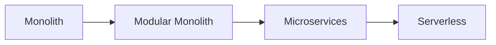

- Monolith is not "legacy" by definition — it can outperform Serverless for simpler workloads
- Microservices bring high complexity; Modular Monolith ≠ Microservices
- Serverless isn't automatically the best option — it can be the most expensive, and is arguably a form of "macroservices"
- Microservices and Serverless *can* have better uptime, but that's not guaranteed by the architecture alone

 
 

## Front-end architectures

- [Link here](./frontend-architecture/README.md)

   
   

## SaaS: Software as a service

- [Link here](./saas/README.md)

   
   

## Three-Tier Architecture

This is the architecture more basic possible, very common!
This is split in 3 parts:

1. Presentation: mobile, front-end
2. Application layer: services
3. Data layer: database, etc.

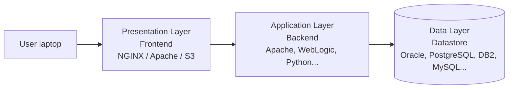

| | Notes |
| --- | --- |
| Scaling | Each layer scales independently — only scale the layer under load |
| Operability | Easy to operate, monitor, and debug |
| Security | Each layer can be secured independently |
| Testability | Easy to test and reuse code |
| Fit | Usually monolithic, fits less-complex architectures |

 
 

## Container Architecture or Architecture by containers

Is running my services by container. Each container is a copy of other, then, you can add a loadbalancer and give requests to each other... The containers are the same but run in different ports and locale, so if you one of them fall, you have the another one.

1. You might need one orchestrator to work with Redundancies or Circuit breaker

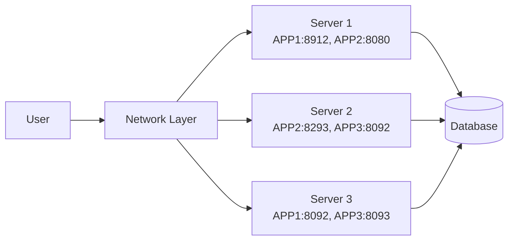

**Container orchestrator** — a control plane manages many data planes (one per node), each running its own set of app containers and reporting CPU/memory usage back up:

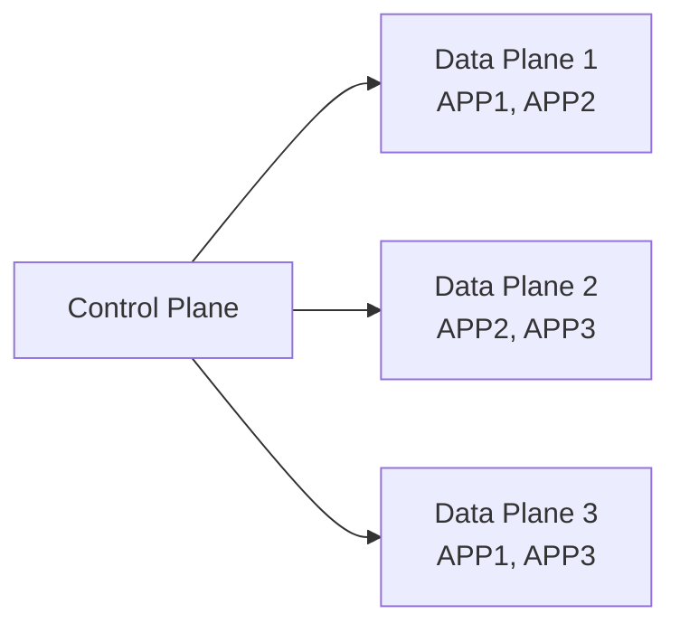

| Vantagens | Desvantagens |
| --- | --- |
| Portabilidade | Complexidade na gestão |
| Eficiência de recurso | Monitoramento e logging |
| Isolamento | Neighbor Noise |
| Escalabilidade | Custos |
| Deployments e Rollbacks simples | Complexidade de rede |
| Organização | Requisitos de Microserviços |

 
 

## Serverless Architecture

In Serverless you don't need to manager the servers, because the company/provider is already manager it for you. Then, you can only run your code, logic without need to manager the hardware, etc..

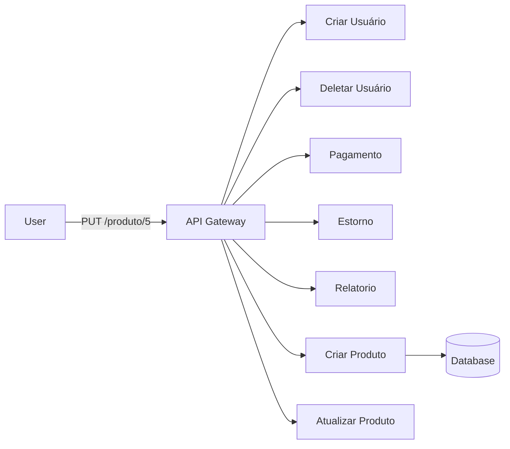

**Decomposition** — a monolith evolves into independent microservices, each broken further into single-purpose functions:

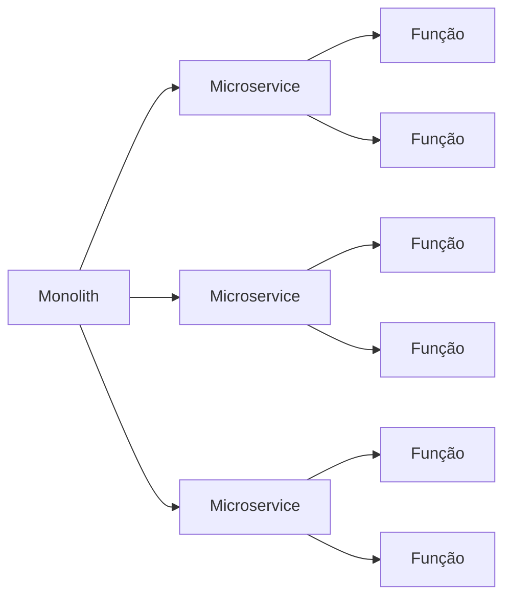

| Vantagens | Desvantagens |
| --- | --- |
| Eficiência de recurso | Complexidade Arquitetônica |
| Escalabilidade "automática" | Limitações de tempo e quantidade |
| Observabilidade | Observabilidade (double-edged: harder without the right tooling) |
| Abstração de recursos de infra | Customizações não disponíveis |
| Deployment rápido e simples | Tempo de inicialização (cold start) |
| Foco no código/negócio | Vendor Lock-in |
| — | Custo (can spike unpredictably) |

 
 

## Architecture based in events (SYNC x ASYNC)

- `SYNC`: the request call each resource/service and answer to the user

  - ADVANTAGES: easy logs, monitoring, observability
  - DISADVANTAGES: the advantages of ASYNC

- `ASYNC`: receive the call and return a response with like `{ status: processing }`. Then, process many things behind and return layer
  - ADVANTAGES: quickly client response, scale, easy integration with new systems, easy retries in case when fails
  - DISADVANTAGES: the advantages of SYNC

Another thing of ASYNC x SYNC is that is not easy to handle with RACE CONDITIONS, when you consume a event and save in the database,
but another service needs to have the same data updated before a request. For example:

1. user create account
2. account is being replicated
3. user try to buy something
4. **the product services returns error that user was not found in the replicated-users collection**
   1. how to resolve? events retries?

**SYNC:**

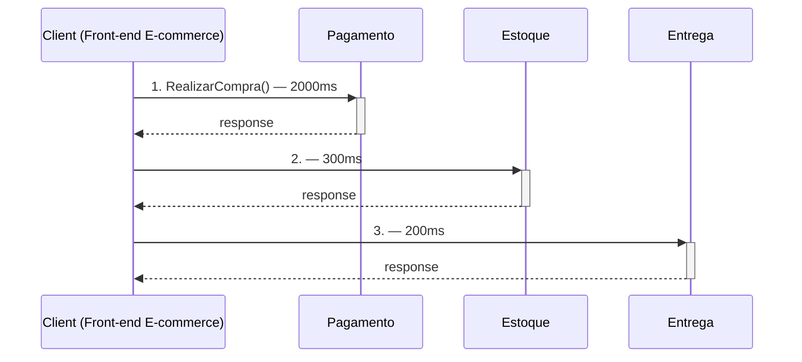

**ASYNC:**

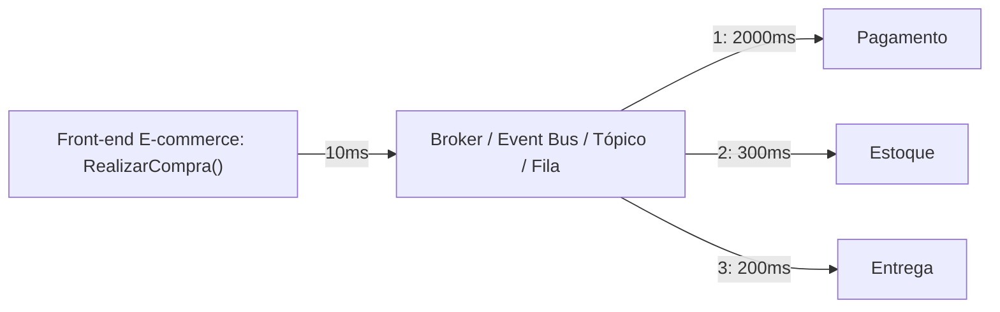

### SNS (x) SQS (x) KAFKA

- `SNS`: its a topic that receive messages from producers and distributes to the listenings
- `SQS`: its a a queue that receive messages from SNS or services that publish in the queue as a publishers.
  - the queue should only delivery the message 1 only, to avoid duplicate data or process
- `apache KAFKA`: Very large volumes of data, flexible scalability, and basic routing needs.
  - you can audit the message cause kafka as a log that you can audit it in case needs (replicate a bug? gov auditor?)
  - lots power but lots complexity to implement and manager
  - runs in a cluster and you are responsible for this infrastructure
  - indicate to process real time data

SNS x SQS

reference: https://blog.awsfundamentals.com/aws-sns-vs-sqs-what-are-the-main-differences

SNS is simply forwarding all messages to your subscribed consumers and SQS saves the messages in a queue and waits till they get picked up

| | SQS | SNS |
| --- | --- | --- |
| Push vs Poll | Poll | Push |
| Relationship | Many to one | Many to many |
| Consumer types | Application to Application | Application to Application, Application to Person |
| Persistence | ✅ | ❌ |
| Reliability / Retries | ✅ | ❌ |
| Batching | ✅ | ❌ |

**Consumer types by delivery target:**

| Application to Application | Application to Person |
| --- | --- |
| Lambda, SQS, Kinesis, Endpoint, Eventfork Pipeline | Chatbot, In-App, SMS, Email, Pagerduty |

**Persistence/retry flow:**

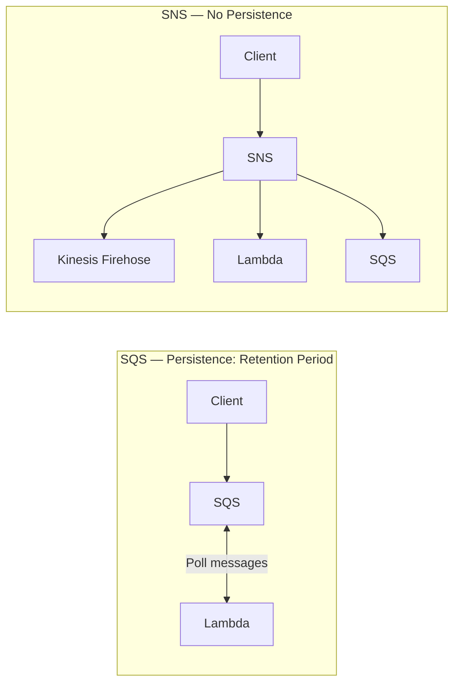

SQS can add a Redrive Policy. This policy defines how many times a failed message should be retried before it will be moved to a Dead Letter Queue (DLQ). The DLQ handles failed messages. For example, you could save failed messages in a bucket and inform the developer about them.

SNS doesn't offer retries when the client fails. In case a consumer is not available or the consumer fails to work on the message (e.g. push notification won't come through) the message can't be repeated. This is due to the asynchronous nature of SNS.

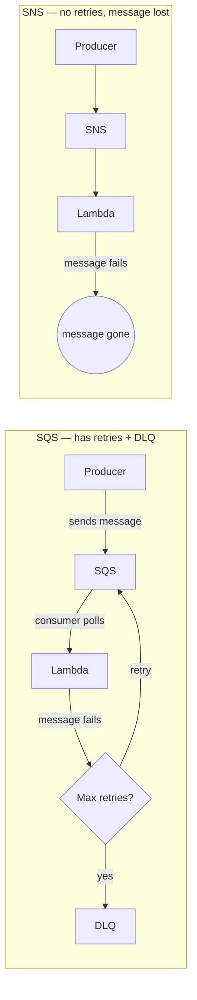

Kafka 

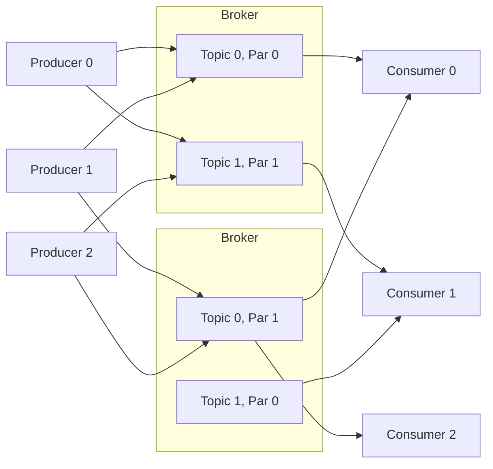

Typical use: Apache Kafka sits between producers (custom apps) and consumers (microservices, monitoring, analytics) on one side, and data sources (Bloomberg, Twitter, NoSQL, Oracle, SFDC, Hadoop, Data Warehouse) on the other.

 
 

# System Patterns

## API Gateway Pattern

API Gateway is a pattern that manager the follow rules:

1. Credentials
   - _like context, routes, etc._
   - _NOT AUTHORIZATION, the authorization should be another service_
2. Routes
3. Contracts validation
4. Loading balancer
5. Limits of calls: like, hey my services handle only with 100 request per minute, then return 429 too many request.
6. Cache: might have a cache here, and add a TTL for some routes

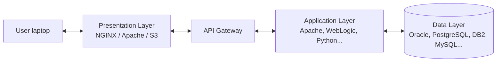

 
 

## Load Balancing Pattern

Is pattern as well, and basically you manager the request and distributes the request between the services or gateway.

1. (+) can add health check for the services connected
2. (-) have mo latency once you have more layers behind the client's call
3. (+) manager SSL certificates
4. (+) Help on releasing V1, V2, V3 with deploy canary for example

Algorithms that also do Load Balance:

- Round Robin
- Least Connections
- Least Time
- Hash
- IP Hash
- Random with Two Choices

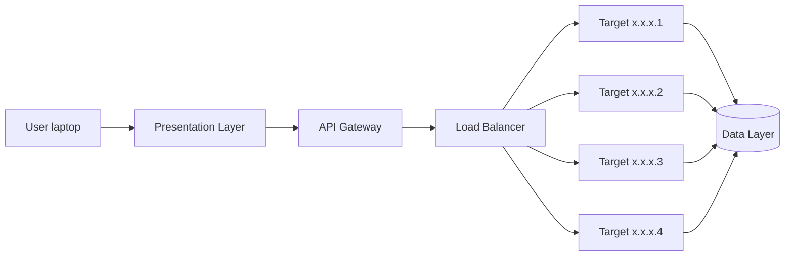

- Distributes load; enables horizontal scalability
- Used for redundancy/high availability (different from DNS TTL — DNS maps name→IP, LB distributes traffic across IPs)
- Reduces load on the origin server (if external/managed LB)
- Controls user affinity (stickiness)
- Health-checks targets, monitors them
- Facilitates deployment
- Manages SSL certs at the edge so the application doesn't have to

 
 

## Caching and `CDN (data more close to the user by location)`

CDN is a service/strategy that for the first request of the user, they load a picture/video and save in the database more close to the user location. Then, for the next users, that data will be requested easier. It is a kind of caching strategies.

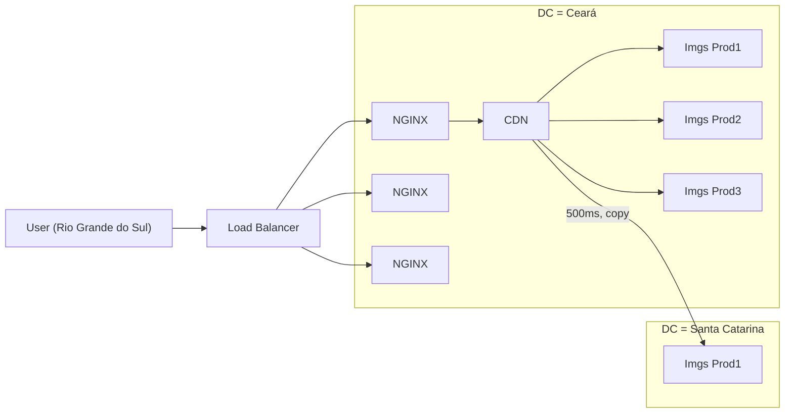

1. User from the South requests a product image
2. CDN receives the request, gets the object from the datastore in the nearest DC (Ceará)
3. The object is copied/replicated to the closest datacenter for that user (Santa Catarina) — future requests from that region hit the closer copy

| Caching — pros | Caching — cons |
| --- | --- |
| Reduces response time, more efficient resource use | Costs increase |
| Avoids overhead of repetitive/expensive DB actions | Architecture becomes more complex (more moving pieces) |
| Can improve efficiency of other DB queries | Requires managing TTL and invalidation |
| Increases scalability/availability, reduces single point of failure | Doesn't fit every case — sometimes you need strong consistency |

 
 

## Stateless (x) Stateful

- `Stateful`: the server holds state (code, local DB, files on disk, backups) — I can't lose this specific server
- `Stateless`: state is externalized (separate DB/storage/backup services) — I can lose the server without losing data

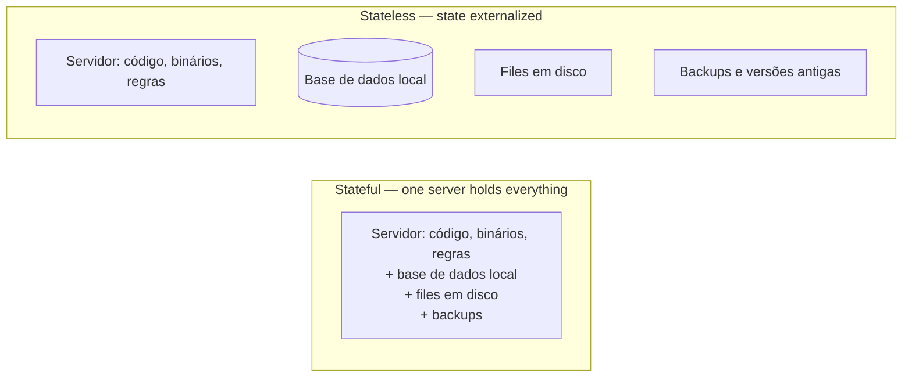

| Stateless | Stateful |
| --- | --- |
| Aplicações escaláveis mais simples (horizontal) | Aplicações escaláveis não são simples (vertical) |
| Maior resiliência e menor complexidade de implementação | Menor resiliência e maior complexidade de implementação |
| Manutenção mais "simples" | Depuração de código mais simples |
| Repetição de dados (across instances) | Dado centralizado |
| Requer outras coisas (IaC, LB, ASG...) | Geralmente só requer um DNS |
| Comunicação via rede | Comunicação via barramento |
| Monitoração (harder — many instances) | Monitoração (simpler — one place) |
| Eficiência de deployment e entregas | Deployments mais difíceis |

 
 

## Monolith (x) Modular Monolith (x) Microservices

- `Monolith`: everything is in the same port
- `Modular Monolith`: the modules are in different ports, so I can add in different servers but they can use the same database
- `Microservices`: Everything is independent of each other. DATABASES NEED TO BE INDEPENDENT FOR EACH SERVICES, they can have references like in the database X in table Y we have a field.ID that refer to another service > database.

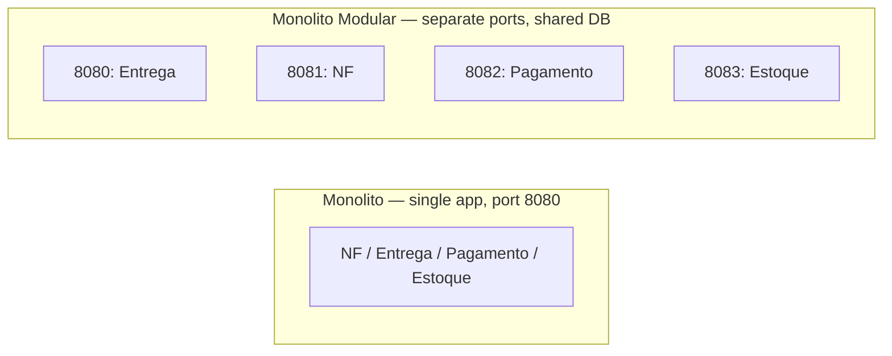

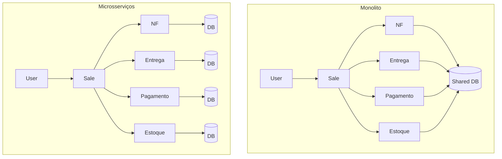

| Aspecto | Monolito | Microsserviços |
| --- | --- | --- |
| Deployment | Simple (single unit) | More complex (many units) |
| Código | Concentrated | Modular, distributed |
| Logs, métricas e tracing | Fácil | Complexo |
| Escalabilidade | Difícil (scale everything together) | Boa (scale services independently) |
| Testabilidade | Fácil | Difícil (more moving parts, contracts) |
| Blast radius / impacto | Alto (one bug can bring down everything) | Baixo (contained to one service) |
| Custo | Menor | Maior |
| Operação | Fácil | Difícil |
| Segurança | Fácil (one surface) | Difícil (many surfaces) |

 
 
