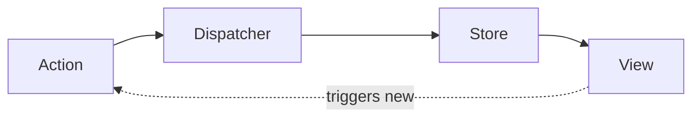

SUMMARY

- [REACT](#react)
    - [what is react ?](#what-is-react-)
    - [why react x other frameworks like ANGULAR ?](#why-react-x-other-frameworks-like-angular-)
    - [what is components ?](#what-is-components-)
    - [what is Virtual DOM ?](#what-is-virtual-dom-)
    - [what is JSX in browser?](#what-is-jsx-in-browser)
    - [how to create a event in react?](#how-to-create-a-event-in-react)
    - [\_\_\_ what are hooks ?](#___-what-are-hooks-)
    - [\_\_\_ useState ? useEffect ? useContext ?](#___-usestate--useeffect--usecontext-)
    - [\_\_\_ React.memo or useMemo() ?](#___-reactmemo-or-usememo-)
    - [\_\_\_ Side effect ?](#___-side-effect-)
    - [\_\_\_ React lifecycle ?](#___-react-lifecycle-)
    - [\_\_\_ controlled and uncontrolled components ?](#___-controlled-and-uncontrolled-components-)
    - [\_\_\_ Redux and React store ?](#___-redux-and-react-store-)


# REACT

### what is react ?

React is a framework to build front-end coding HTML with Javascript in the same file,
like the properly extension is JSX.

<br>
<br>

### why react x other frameworks like ANGULAR ?

- easy to understand
- reasuble components without modulation
- debug errors or bugs are easy due the:
  - unidirectional data flow which is `components` > `children`, always like that

</br>
</br>

### what is components ?

are basically blocks in the view, that you split in react components and render them has any update in that component

</br>
</br>

### what is Virtual DOM ?

Basically React a virtual DOM which is a copy form Real DOM.
With that, React is able to check the elements that were updated
in the virtual dom and then those specific elements in the REAL dom

WIN: Hight performance with a fast web application

</br>
</br>

### what is JSX in browser?

No, the JSX are compiled to the browser javascript by BABEL.

</br>
</br>

### how to create a event in react?

1. create a function
2. in the component, create a props like `onClick`
3. add this function in the props
4. when the component receives a click, the function is called by on click event

```jsx
class Simple extends React.Component {
  work() {
    alert("Good Work!");
  }
  render() {
    return <button onClick={this.work}>Do some work!</button>;
  }
}
```

</br>
</br>

### \_\_\_ what are hooks ?

Hooks are functions that allow you to use state and control the life lifecycle in components. Then, you can easier control the component logic without using classes.

- BIG WINs
  - easier to read and reuse it.
  - easier to test logics

Like:

- useState
- useEffect
- useContext

</br>
</br>

### \_\_\_ useState ? useEffect ? useContext ?

- `use State`: hook that create a state with a callback to update that state, and when the state is update, the component is rendered again.
- 
  
- `use Effect`: hook that perform side effects in the components:

  - like after the component mount
  - or when the component is updated
  - you can do a effect on that
    - examples: fetching data, update states if a due condition is checked
```JS
// will run any time the component is rendered
useEffect(function); 

// run only once
useEffect(function, []); 

// only run if the props in the list changes
useEffect(function, [ ANY_PROP, ..n ]); 
```

-
-
- `use Context`: is hook that share states or data without passing without passing props by children components.
  - example:

```js
|___ component_A // state here
    |___children_B
        |___children_C
            |____children_D // access context from component A
```

</br>
</br>

### \_\_\_ React.memo or useMemo() ?

is a way to improve the performance from a heavy component that renders from a set of inputs. Then, the memo will memorize the same component results for the same set of inputs.

</br>
</br>

### \_\_\_ Side effect ?

is the effects for example by hooks that you return a callback for clean up.

That's avoid memory leaks or behaviors that you dont want.

</br>
</br>

### \_\_\_ React lifecycle ?

basically you have

1. component creation
2. re-rendering the component when updates by props/state
3. when you destroy it the component
   1. like given a state, return another component

</br>
</br>

### \_\_\_ controlled and uncontrolled components ?

controlled components are those who receive props and change the behavior based on the props states.

uncontrolled are components build without props or way for manipulate them.

</br>
</br>

### \_\_\_ Redux and React store ?

- `dispatcher`: action that sends an action to your store to manipulate an state update.

REDUX or STORE flow:



