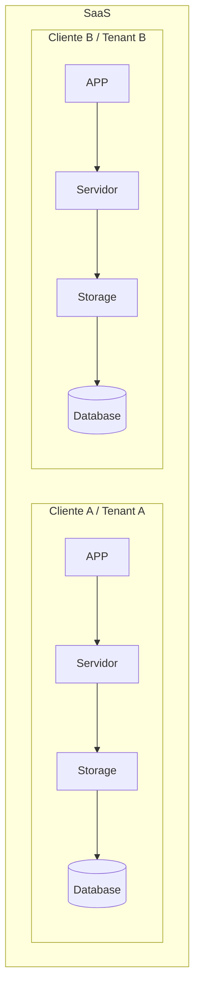
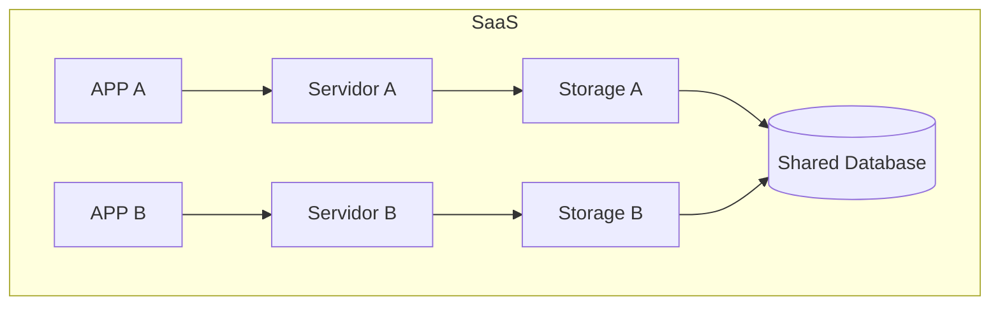
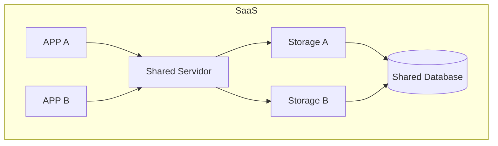
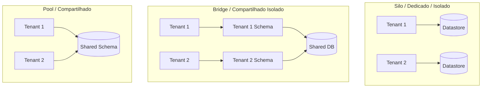
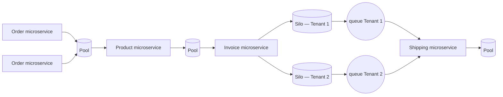

# SECTION-1

Software as a Service (SaaS)

- [SECTION-1](#section-1)
  - [SINGLE-Tenant (vs) MULTI-Tenant](#single-tenant-vs-multi-tenant)
  - [Single or Multi, what is the better option?](#single-or-multi-what-is-the-better-option)
  - [Architecture models](#architecture-models)
  - [Before implement, think about the challenges](#before-implement-think-about-the-challenges)
  - [How to identify the peaces if it is SILO, BRIDGE or POOL](#how-to-identify-the-peaces-if-it-is-silo-bridge-or-pool)
  - [Best Practices](#best-practices)
  - [Factor App](#factor-app)

 
 
 

## SINGLE-Tenant (vs) MULTI-Tenant

**SINGLE-Tenant**: is when each Tenant is isolated from other Tenants. Its means that if the TENANT-A has issue, it wont affect the TENANT-B, because they are ISOLATED

**MULTI-Tenant**: is when one OR more layers are sharing resources. Then, a fail caused by TENANT-A might affect OTHERS TENANTs.

1. Sharing the database only:

2. Sharing the server (gateway) + database:

**SaaS and Multi-Tenant are not the same thing:**

| Aspecto | SaaS | Multi-Tenant |
| --- | --- | --- |
| Definição | Modelo de negócio que oferece software como serviço | Modo de alocação de recursos onde múltiplos clientes compartilham infraestrutura |
| Enfoque | Crescimento, eficiência, experiência de usuário | Eficiência de custo e uso de recursos compartilhados |
| Implementação | Pode usar recursos compartilhados (multi-tenant) ou dedicados (single-tenant) | Tipicamente envolve compartilhamento de recursos |
| Flexibilidade | Alta — pode variar infra por tenant | Pode ter níveis variados de isolamento (Silo/Bridge/Pool) |

**Single-Tenant (x) Multi-Tenant**

| Single-Tenant / Mono Locatário | Multi-Tenant / Multi Locatário |
| --- | --- |
| Cliente tem recursos dedicados apenas para ele, nada é dividido, completamente isolado | Recursos compartilhados entre diferentes clientes, isolados a nível de aplicação |
| Não precisa se preocupar com Neighbor Noise | Custo geralmente é mais eficiente |
| Personalização por cliente | Manutenção gera impacto em N clientes |
| Manutenção mais demorada, porém mais seguro | Um cliente pode afetar outro (Neighbor Noise) |
| Custo alto — vários controles necessários (monitoramento, config. personalizada) | Complexo escalar um único usuário, isolar acessos, personalizar |

 
 
 
 

## Single or Multi, what is the better option?

Make these questions to myself before decide of single or multi tenant.

class: https://www.udemy.com/course/fundamentos-de-arquitetura-saas/learn/lecture/45466277#overview , https://www.udemy.com/course/fundamentos-de-arquitetura-saas/learn/lecture/45466283#notes

- Qual o nível de isolamento por questões de segurança e conformidade que seus clientes vão precisar?
- Será um SaaS para enterprises ou não?
- Qual o custo final do seu produto?
- Você terá diferentes planos? Qual será o diferencial entre eles?
- Você está pronto para prover todos os control-planes necessários?
- Qual o tamanho da sua equipe de TI?
- Qual nível e tipo de customização você irá prover pro seu cliente?
- Qual a expectativa da quantidade de usuários, acessos e horários? (TPS, TPM)

 
 
 
 

## Architecture models

- SILO: everything is isolated
- BRIDGE: one service might be shared, like:
  - log server: each container or folder per Tenant, _but all in the same server_
  - database: each table or schema per Tenant, _but all in the same server_
- POOL: is shared, everything is shared.
  - database: only one table with all Tenant
  - topics: all of them is subscribed to the same topic

We can also have some parts of the ecosystem with different models of Architecture — mixing Silo/Pool/Bridge per service based on what actually needs isolation:

- Order: siloed compute, pooled storage
- Product: pooled compute and storage
- Invoice: pooled compute, siloed storage (one silo per tenant)
- Queues: siloed per tenant
- Shipping: pooled compute and storage, consuming siloed queues

Reference: https://docs.aws.amazon.com/whitepapers/latest/saas-architecture-fundamentals/removing-the-single-tenant-term.html , class: https://www.udemy.com/course/fundamentos-de-arquitetura-saas/learn/lecture/45466289#notes

With this option you can isolate only the things that matter in terms of confidentiality, and be more competitive in the market with a lower cost of architecture.

 
 
 
 

## Before implement, think about the challenges

Make questions to myself to reach these scenarios:
_(google the names, these are common problems in SaaS architecture)_

Class: https://www.udemy.com/course/fundamentos-de-arquitetura-saas/learn/lecture/45469601#notes

- Ter observabilidade por cliente dentro de uma arquitetura SaaS (Pool, Bridge ou Silo)
- Implementação e gerenciamento de customizações por clientes
- Fazer previsão de capacidade e habilitar escalabilidade
- Ter mecanismos de throttling, limites, quotas para todos componentes de infra
- Ter capacidade de isolar um "vizinho barulhento" (noisy neighbor)
- Ter diferentes shards/células
- Pipelines de deployments com raio de impacto baixo
- Mecanismo de onboard/offboard

 
 
 
 

## How to identify the peaces if it is SILO, BRIDGE or POOL

1. start from here: https://www.udemy.com/course/fundamentos-de-arquitetura-saas/learn/lecture/45706011#notes

2. the BEST class: https://www.udemy.com/course/fundamentos-de-arquitetura-saas/learn/lecture/45706013#notes

 
 
 
 

## Best Practices

Class: https://www.udemy.com/course/fundamentos-de-arquitetura-saas/learn/lecture/45469605#notes

- Não existe one-size-fits-all — cada negócio SaaS tem necessidades e requisitos específicos que influenciam sua arquitetura
- Decomponha cada serviço com base em sua carga multi-tenant e necessidade de isolamento
- Isolamento entre as diferentes tenants — a saúde de um software SaaS se traduz em segurança e resiliência
- O modelo de negócio pode ser altamente escalável — garanta que sua arquitetura possibilite evolução rápida
- Tenha observabilidade tenant-aware
- Processo de Onboard e Offboard deve ser simples, rápido, transparente e automático
- Separação de componentes de Control Planes e Data Planes
- Nem tudo precisa ser isolado — ter customização em um componente não implica isolá-lo/dedicá-lo
- Abstraia a complexidade da arquitetura SaaS para desenvolvedores e clientes

## Factor App

Sugiro fortemente colocar nos to-dos entender um pouco mais sobre 12-factor app. Aqui uma sequência interessante que cobre todos.

12 - Factor app - Documentação oficial

12 - Factor app - Youtube:

1. [The Twelve-Factor App - Introdução - Padrões de aplicações SaaS](https://youtu.be/haZTaCFk-DA)
2. [The Twelve-Factor App - (Backing services) e Construa, Lance, execute (Build, Release, Run)](https://youtu.be/p0oM_iGREpI)
3. [The Twelve-Factor App - Processos, Vínculo de Porta e Concorrência](https://youtu.be/onoXOUOLgjI)
4. [The Twelve-Factor App - Descartabilidade (Disposability) e devprod iguais (DevProd parity)](https://youtu.be/b-dCQTjIIsc)
5. [The Twelve-Factor App - Logs e Processos de Admin (Admin Processes)](https://youtu.be/wWVo6f6k12k)
6. [The Twelve-Factor App - Telemetria e Autenticação e Autorização](https://youtu.be/BOKGgMKPtv4)

