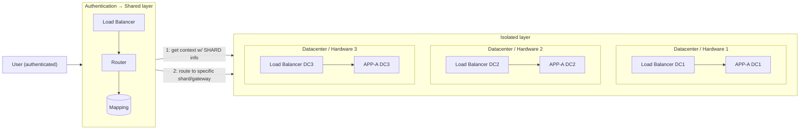
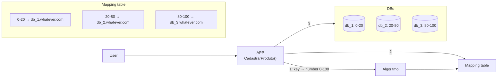
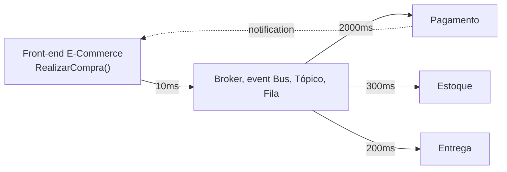
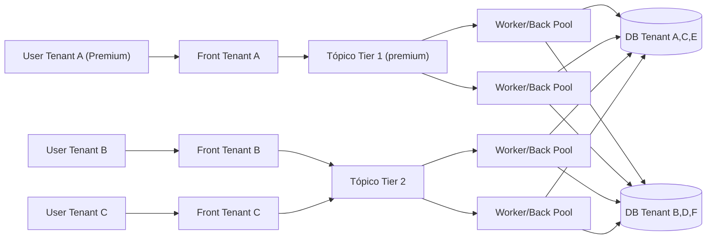
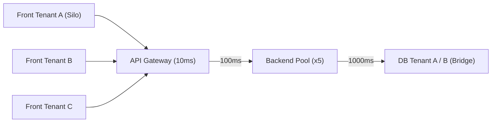
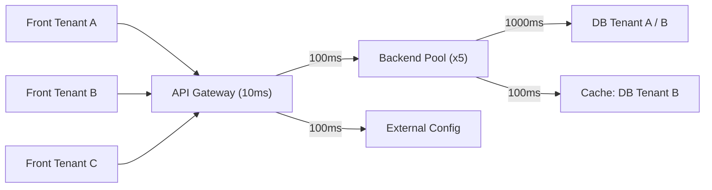

# SECTION-2

Software as a Service (SaaS)

- [SECTION-2](#section-2)
- [Traffic Sharding (Fragment traffic/requests)](#traffic-sharding-fragment-trafficrequests)
- [Database Sharding (Fragment traffic/requests)](#database-sharding-fragment-trafficrequests)
- [Consistent Hashing](#consistent-hashing)
- [SYNC and ASYNC in SaaS](#sync-and-async-in-saas)
- [CACHE in SaaS](#cache-in-saas)

 
 

# Traffic Sharding (Fragment traffic/requests)

class: https://www.udemy.com/course/fundamentos-de-arquitetura-saas/learn/lecture/45469621#notes

This is fragment your traffic or request to have a specific SHARED (containers, data-center, etc).

This strategy is used when I want to have a PREMIUM users with more CPU/MEMORY, ETC then other common users.

> LOAD BALANCING: is the method of distributing network traffic equally across a pool of resources that support an application, it already have Algorithm of put the request in a free instances

| Traffic Sharding — pros | Traffic Sharding — cons |
| --- | --- |
| Escalabilidade e distribuição de carga | Complexidade operacional e de monitoramento (requer control planes) |
| Isolamento de recursos em menores grupos | Custo pode ser alto e utilização de recurso pode não ser eficiente |
| Cada grupo de usuários pode ser escalado por uso/customização (ex. Premium) | Camada de rede maior — mais hops, ainda que o tempo de resposta possa compensar |
| Redução de área de impacto durante problemas | |
| Reduz e controla tenants e/ou grupo de tenants | |

 
 
 
 

# Database Sharding (Fragment traffic/requests)

class: https://www.udemy.com/course/fundamentos-de-arquitetura-saas/learn/lecture/45469625#notes

Split data in many databases to have a better performance and scalability, distributing resources on servers.

Scenario: imagine have a subscription of products in my platform. Then, I can have a database sharding where my clients go to the databases that I want according to my business rules.

1. user SUBSCRIBE A PRODUCT
2. user has a context with user information > after the authorization
   1. like user-id
3. then, I have an application that decode the user-ID -> db mapping
4. the mapping is basically a map of users group to a specific database
   1. like, users 0-20 to DB 1
   2. like, users 21-40 to DB 1

| Database Sharding — pros | Database Sharding — cons |
| --- | --- |
| Microgerenciamento de usuários via tabela de mapping | Cuidado: o algoritmo pode ter um limite que não permite crescimento de novos usuários |
| Algoritmo "dividir para conquistar" — melhora performance | Alterar o algoritmo pode ser complexo e exigir remanejamento de todos os dados |
| Melhora o Blast Radius, distribui entre databases | Você precisa manter esse mapping manualmente (consistent hashing atualiza isso automaticamente ao add/remover targets) |
| Possibilita escalabilidade horizontal para DBs | |

 
 
 
 

# Consistent Hashing

class: https://www.udemy.com/course/fundamentos-de-arquitetura-saas/learn/lecture/45469627#notes

 
 
 
 

# SYNC and ASYNC in SaaS

class: https://www.udemy.com/course/fundamentos-de-arquitetura-saas/learn/lecture/45469631#notes

> ASYNC in NOT SaaS architecture:

 here 

1. user buy something
2. the broker put the request in a topic
3. the payment service process it and get back to the user if fails or success
4. the other services do the same and process everything async and make communication with the users by notification

 

> ASYNC in SaaS

1. the users which already have the context information etc
2. with that information, we add a different topics per user like PREMIUM or NOT
3. then, the `premium topic` goes to a `premium pool` with best resources
   1. in this pool i can scale more to process it faster
4. in the another pool for `free` users, I can process it lazy

 
 
 
 

# CACHE in SaaS

class: https://www.udemy.com/course/fundamentos-de-arquitetura-saas/learn/lecture/45469633#notes

How to keep the consistency of caching with a SaaS architecture

> CACHE in NOT SaaS architecture:

 here 

1. user request the API gateway
2. gateway request a internal pool services
3. services go to the database
   1. database check if data is in the cache
   2. `in cache`: return the data from cache
   3. `not in cache`: run db operation and save i cache
4. return the data to the user

Response times without tenant-aware caching: every request pays the full 1410ms round trip (Front → Gateway → Backend Pool → DB), regardless of tenant.

> CACHE in SaaS architecture:

1. user request the API gateway
2. gateway check the external config and see which users has cache or not
   1. users premium that need a premium service
3. services go to the database
   1. database check if data is in the cache
   2. `in cache`: return the data from cache
   3. `not in cache`: run db operation and save i cache
4. return the data to the user

With tenant-aware external config + cache, a request for a cached tenant (e.g. Tenant B) drops from 1510ms to 610ms — the gateway checks config to see which tenants have caching enabled, and routes accordingly.

